# Dependency Graph

## Current State (Updated 2026-05-14)

Phase 1 (Infrastructure & Quality) and Phase 2 (Deployment Pipeline) are **complete**. Custom domain (#40) is backlogged. Phase 3 (Trainer-Client Workflow) is in progress — #66 (accept/reject flow) is done with follow-up bug fixes tracked in #80-#85.

## Dependency Chains

```
Web deployment:
  #38 (Expo export) ✅ → #39 (Vercel deploy) ✅ → #40 (custom domain) 🔜 backlog

Trainer workflow:
  #66 (accept/reject flow) ✅ → #18 (client list) → #67 (client activity on dashboard)
  #18 → #23 (client goals)
  #30 (user custom workouts) → #21 (public programs)
  #20 (workout assignment) → #22 (feedback/notes)

Quality & DX:
  #68 (Supabase types) ✅
  #63 (login test) ✅
  #38 (Expo export) ✅ → CI workflow ✅

Bug fixes from #66:
  #80 (hide trainer email), #81 (permanent trainer code), #82 (fix names showing '?'),
  #83 (email confirmation), #84 (profile page not loading), #85 (client notification)

Independent (no blockers):
  #25, #26, #27, #28, #29, #24, #31
```

## Mermaid Diagram

```mermaid
graph TD
    %% Web deployment pipeline
    38[#38 Expo export ✅] --> 39[#39 Vercel deploy ✅]
    39 --> 40[#40 custom domain 🔜]
    38 --> CI[CI workflow ✅]

    %% Trainer workflow
    66[#66 accept/reject flow ✅] --> 18[#18 client list + progress]
    18 --> 67[#67 client activity dashboard]
    18 --> 23[#23 client goals]
    30[#30 user custom workouts] --> 21[#21 public programs]
    20[#20 workout assignment] --> 22[#22 feedback/notes]

    %% Bug fixes from #66
    66 --> 80[#80 hide trainer email]
    66 --> 81[#81 permanent trainer code]
    66 --> 82[#82 fix names '?']
    66 --> 83[#83 email confirmation]
    66 --> 84[#84 profile page]
    66 --> 85[#85 client notification]

    %% Independent features
    25[#25 AI suggestions]
    26[#26 nutrition]
    27[#27 sleep/recovery]
    28[#28 challenges]
    29[#29 achievements]
    24[#24 video form checks]
    31[#31 messaging]

    %% Styling
    classDef done fill:#2d6,stroke:#1a4,color:#fff
    classDef backlog fill:#f90,stroke:#c60,color:#fff
    classDef core fill:#36f,stroke:#24c,color:#fff
    classDef bug fill:#e44,stroke:#b22,color:#fff
    classDef future fill:#999,stroke:#666,color:#fff

    class 38,39,CI,66 done
    class 40 backlog
    class 18,67,20,22,23,30,21 core
    class 80,81,82,83,84,85 bug
    class 25,26,27,28,29,24,31 future
```



## Closed Issues (already merged)

The following dependencies are satisfied — no longer blockers:

| # | Title | Status |
|---|---|---|
| #1 | Language selection reactivity | Merged |
| #2 | Hardcoded Bulgarian strings | Merged |
| #3 | Workout saving atomicity | Merged |
| #4 | Forgot password button | Merged |
| #5 | Home screen error swallowing | Merged |
| #7 | Pointer events CSS | Merged |
| #8 | Testing infrastructure | Merged |
| #9 | Loading states | Merged |
| #10 | Auth form validation | Merged |
| #11 | Offline/network error handling | Merged |
| #12 | Edit Profile screen | Merged |
| #13 | Dark theme toggle | Merged |
| #14 | Push notifications setup | Merged |
| #16 | Client-trainer schema + linking | Merged |
| #17 | Trainer dashboard | Merged |
| #19 | Custom workout builder | Merged |
| #34 | Responsive breakpoint hook | Merged |
| #35 | Desktop sidebar navigation | Merged |
| #36 | Responsive layout adjustments | Merged |
| #37 | PWA config | Merged |
| #38 | Expo static export config | Merged |
| #39 | Vercel deployment | Merged |
| #63 | Login screen component test | Merged |
| #64 | Skeleton/loading for workouts | Merged |
| #65 | Block destructive actions offline | Merged |
| #66 | Accept/reject trainer-client flow | Merged |
| #68 | Supabase type generation | Merged |

## Recommended Resolution Order

### ~~Phase 1 — Infrastructure & Quality~~ ✅ COMPLETE

All items resolved: #38, #68, #63, #64, #65, CI workflow.

### ~~Phase 2 — Deployment Pipeline~~ ✅ COMPLETE

#39 merged. #40 (custom domain) deferred to backlog — no code dependency, just DNS purchase.

### Phase 3 — Trainer-Client Workflow (core value) ← CURRENT

| Order | Issue | Rationale |
|---|---|---|
| — | #80-#85 — Bug fixes from #66 | Polish existing flow before building on it |
| 8 | #18 — Client list & progress monitoring | Trainer's primary view |
| 9 | #67 — Client workout activity on dashboard | Builds on #18, high value |
| 10 | #20 — Workout assignment trainer→client | Core trainer feature |
| 11 | #30 — Users create custom workouts | Builder already exists, add user-facing flow |
| 12 | #21 — Public workout programs | Marketplace, depends on workout content |
| 13 | #23 — Client goal setting | Leverages #18 progress data |
| 14 | #22 — Workout feedback/notes | Depends on #20 assignment flow |

### Phase 4 — Advanced Features

| Order | Issue | Rationale |
|---|---|---|
| 15 | #31 — In-app messaging | Large scope, all deps already met |
| 16 | #25 — AI programming suggestions | Independent, medium scope |
| 17 | #24 — Video form checks | Complex (camera/upload), independent |

### Phase 5 — Wellness & Gamification (lowest priority)

| Order | Issue | Rationale |
|---|---|---|
| 18 | #26 — Nutrition logging | New domain, no deps |
| 19 | #27 — Sleep & recovery tracking | New domain, no deps |
| 20 | #28 — Gamification: challenges | Best after core features exist |
| 21 | #29 — Gamification: achievements | Best after core features exist |

## Critical Path

The primary critical path now is the **trainer workflow:**

```
#80-#85 (bug fixes) → #18 (client list) → #20 (assignment) → #22 (feedback)
```

Secondary paths (#30→#21, #18→#67, #18→#23) can be parallelized.

## Notes

- Phase 1+2 completed 2026-05-14
- #66 follow-up bugs (#80-#85) should be resolved before starting #18
- #40 (custom domain) requires purchasing a domain — no code changes needed
- #78 (CI Supabase env vars) is a DX improvement, not blocking anything
- Phases 3-5 can overlap if multiple people are working
- #24 (video form checks) and #31 (messaging) are the largest scope items remaining
