# Dependency Graph

## Current State (Updated 2026-05-15)

Phases 1–3 are **complete**. All trainer-client workflow features (#18, #20, #22, #23, #30, #31, #67) and bug fixes (#75, #78, #80–#85) are merged. Custom domain (#40) remains backlogged. Only Phase 4 (Advanced Features) and Phase 5 (Wellness & Gamification) remain, plus #21 (Public programs).

## Dependency Chains

```
Web deployment:
  #38 (Expo export) ✅ → #39 (Vercel deploy) ✅ → #40 (custom domain) 🔜 backlog

Trainer workflow (ALL COMPLETE):
  #66 (accept/reject flow) ✅ → #18 (client list) ✅ → #67 (client activity dashboard) ✅
  #18 ✅ → #23 (client goals) ✅
  #30 (user custom workouts) ✅ → #21 (public programs) 🔜
  #20 (workout assignment) ✅ → #22 (feedback/notes) ✅

Quality & DX:
  #68 (Supabase types) ✅
  #63 (login test) ✅
  #38 (Expo export) ✅ → CI workflow ✅ → #78 (CI env vars) ✅

Bug fixes (ALL COMPLETE):
  #75 (input validation) ✅, #78 (CI secrets) ✅
  #80 (hide trainer email) ✅, #81 (permanent trainer code) ✅, #82 (fix names '?') ✅,
  #83 (email confirmation) ✅, #84 (profile page) ✅, #85 (client notification) ✅

Messaging:
  #31 (in-app messaging) ✅

Remaining (no blockers):
  #21 (public programs), #24, #25, #26, #27, #28, #29, #40
```

## Mermaid Diagram

```mermaid
graph TD
    %% Web deployment pipeline
    38[#38 Expo export ✅] --> 39[#39 Vercel deploy ✅]
    39 --> 40[#40 custom domain 🔜]
    38 --> CI[CI workflow ✅]
    CI --> 78[#78 CI env vars ✅]

    %% Trainer workflow (all complete)
    66[#66 accept/reject flow ✅] --> 18[#18 client list ✅]
    18 --> 67[#67 client activity dashboard ✅]
    18 --> 23[#23 client goals ✅]
    30[#30 user custom workouts ✅] --> 21[#21 public programs 🔜]
    20[#20 workout assignment ✅] --> 22[#22 feedback/notes ✅]

    %% Messaging
    31[#31 messaging ✅]

    %% Bug fixes (all complete)
    66 --> 80[#80 hide trainer email ✅]
    66 --> 81[#81 permanent trainer code ✅]
    66 --> 82[#82 fix names '?' ✅]
    66 --> 83[#83 email confirmation ✅]
    66 --> 84[#84 profile page ✅]
    66 --> 85[#85 client notification ✅]

    %% Remaining future features
    21
    24[#24 video form checks]
    25[#25 AI suggestions]
    26[#26 nutrition]
    27[#27 sleep/recovery]
    28[#28 challenges]
    29[#29 achievements]

    %% Styling
    classDef done fill:#2d6,stroke:#1a4,color:#fff
    classDef backlog fill:#f90,stroke:#c60,color:#fff
    classDef future fill:#999,stroke:#666,color:#fff

    class 38,39,CI,78,66,18,67,23,30,20,22,31,80,81,82,83,84,85 done
    class 40,21 backlog
    class 24,25,26,27,28,29 future
```



## Closed Issues (already merged)

The following dependencies are satisfied — no longer blockers:

| # | Title | Status |
|---|---|---|
| #1 | Language selection reactivity | Merged |
| #2 | Hardcoded Bulgarian strings | Merged |
| #3 | Workout saving atomicity | Merged |
| #4 | Forgot password button | Merged |
| #5 | Home screen error swallowing | Merged |
| #7 | Pointer events CSS | Merged |
| #8 | Testing infrastructure | Merged |
| #9 | Loading states | Merged |
| #10 | Auth form validation | Merged |
| #11 | Offline/network error handling | Merged |
| #12 | Edit Profile screen | Merged |
| #13 | Dark theme toggle | Merged |
| #14 | Push notifications setup | Merged |
| #16 | Client-trainer schema + linking | Merged |
| #17 | Trainer dashboard | Merged |
| #18 | Client list and progress monitoring | Merged |
| #19 | Custom workout builder | Merged |
| #20 | Workout assignment (trainer→client) | Merged |
| #22 | Workout feedback and notes | Merged |
| #23 | Client goal setting and tracking | Merged |
| #30 | Users create custom workouts | Merged |
| #31 | In-app messaging | Merged |
| #34 | Responsive breakpoint hook | Merged |
| #35 | Desktop sidebar navigation | Merged |
| #36 | Responsive layout adjustments | Merged |
| #37 | PWA config | Merged |
| #38 | Expo static export config | Merged |
| #39 | Vercel deployment | Merged |
| #63 | Login screen component test | Merged |
| #64 | Skeleton/loading for workouts | Merged |
| #65 | Block destructive actions offline | Merged |
| #66 | Accept/reject trainer-client flow | Merged |
| #67 | Client workout activity on dashboard | Merged |
| #68 | Supabase type generation | Merged |
| #75 | Validate workout set input | Merged |
| #78 | CI Supabase env vars | Merged |
| #80 | Hide trainer email | Merged |
| #81 | Permanent trainer code | Merged |
| #82 | Fix names showing '?' | Merged |
| #83 | Email confirmation on signup | Merged |
| #84 | Profile page not loading | Merged |
| #85 | Client notification on accept/reject | Merged |

## Recommended Resolution Order

### ~~Phase 1 — Infrastructure & Quality~~ ✅ COMPLETE

All items resolved: #38, #68, #63, #64, #65, CI workflow, #78.

### ~~Phase 2 — Deployment Pipeline~~ ✅ COMPLETE

#39 merged. #40 (custom domain) deferred to backlog — no code dependency, just DNS purchase.

### ~~Phase 3 — Trainer-Client Workflow~~ ✅ COMPLETE

All items resolved: #18, #20, #22, #23, #30, #31, #67, bug fixes #75, #80–#85.

### Phase 4 — Remaining Features ← CURRENT

| Order | Issue | Rationale |
|---|---|---|
| 1 | #21 — Public workout programs | Only remaining trainer feature; depends on #30 (done) |
| 2 | #40 — Custom domain | DNS purchase + Vercel config, no code deps |
| 3 | #25 — AI programming suggestions | Independent, medium scope |
| 4 | #24 — Video form checks | Complex (camera/upload), independent |

### Phase 5 — Wellness & Gamification (lowest priority)

| Order | Issue | Rationale |
|---|---|---|
| 5 | #26 — Nutrition logging | New domain, no deps |
| 6 | #27 — Sleep & recovery tracking | New domain, no deps |
| 7 | #28 — Gamification: challenges | Best after core features exist |
| 8 | #29 — Gamification: achievements | Best after core features exist |

## Critical Path

All core critical paths are **complete**. The remaining items are independent of each other:

```
#21 (public programs) — only depends on #30 ✅
#40 (custom domain) — DNS purchase, no code dep
#24, #25, #26, #27, #28, #29 — fully independent
```

## Notes

- Phases 1–3 completed by 2026-05-15
- #21 (public programs) is the only remaining feature with a dependency (#30, already done)
- #40 (custom domain) requires purchasing a domain — no code changes needed
- All PR review security findings (PRs #97, #98, #105, #107) are documented but not yet fixed — address before shipping to real users
- Phases 4-5 can be worked in any order since all items are independent
