# Dependency Graph

## Current State (Updated 2026-05-14)

22 open issues remain. Key dependencies (#14, #16, #19) are already closed/merged, unblocking the trainer feature chain. PR #69 (production hardening) added shared error handling, retry infrastructure, and cross-platform confirmation dialogs.

## Dependency Chains

```
Web deployment:
  #38 (Expo export) → #39 (Vercel deploy) → #40 (custom domain)

Trainer workflow:
  #66 (accept/reject flow) → #18 (client list) → #67 (client activity on dashboard)
  #18 → #23 (client goals)
  #30 (user custom workouts) → #21 (public programs)
  #20 (workout assignment) → #22 (feedback/notes)

Quality & DX:
  #68 (Supabase types) — unblocks type safety everywhere
  #63 (login test) — establishes test pattern
  #38 (Expo export) → CI workflow (new recommendation)

Independent (no blockers):
  #64, #65, #25, #26, #27, #28, #29, #24, #31
```

## Mermaid Diagram

```mermaid
graph TD
    %% Web deployment pipeline
    38[#38 Expo export] --> 39[#39 Vercel deploy]
    39 --> 40[#40 custom domain]
    38 --> CI[CI workflow - new]

    %% Trainer workflow
    66[#66 accept/reject flow] --> 18[#18 client list + progress]
    18 --> 67[#67 client activity dashboard]
    18 --> 23[#23 client goals]
    30[#30 user custom workouts] --> 21[#21 public programs]
    20[#20 workout assignment] --> 22[#22 feedback/notes]

    %% Quality
    68[#68 Supabase types]
    63[#63 login test]
    64[#64 skeleton loading]
    65[#65 offline destructive block]

    %% Independent features
    25[#25 AI suggestions]
    26[#26 nutrition]
    27[#27 sleep/recovery]
    28[#28 challenges]
    29[#29 achievements]
    24[#24 video form checks]
    31[#31 messaging]

    %% Styling
    classDef done fill:#2d6,stroke:#1a4,color:#fff
    classDef infra fill:#f90,stroke:#c60,color:#fff
    classDef core fill:#36f,stroke:#24c,color:#fff
    classDef future fill:#999,stroke:#666,color:#fff

    class 38,39,40,CI infra
    class 66,18,67,20,22,23,30,21 core
    class 25,26,27,28,29,24,31 future
```



## Closed Issues (already merged)

The following dependencies are satisfied — no longer blockers:

| # | Title | Status |
|---|---|---|
| #1 | Language selection reactivity | Merged |
| #2 | Hardcoded Bulgarian strings | Merged |
| #3 | Workout saving atomicity | Merged |
| #4 | Forgot password button | Merged |
| #5 | Home screen error swallowing | Merged |
| #7 | Pointer events CSS | Merged |
| #8 | Testing infrastructure | Merged |
| #9 | Loading states | Merged |
| #10 | Auth form validation | Merged |
| #11 | Offline/network error handling | Merged |
| #12 | Edit Profile screen | Merged |
| #13 | Dark theme toggle | Merged |
| #14 | Push notifications setup | Merged |
| #16 | Client-trainer schema + linking | Merged |
| #17 | Trainer dashboard | Merged |
| #19 | Custom workout builder | Merged |
| #34 | Responsive breakpoint hook | Merged |
| #35 | Desktop sidebar navigation | Merged |
| #36 | Responsive layout adjustments | Merged |
| #37 | PWA config | Merged |

## Recommended Resolution Order

### Phase 1 — Infrastructure & Quality (do first)

| Order | Issue | Rationale |
|---|---|---|
| 1 | #38 — Expo static export config | Unblocks deployment pipeline and CI |
| 2 | #68 — Supabase type generation | Unblocks type safety across all features |
| 3 | #63 — Login screen component test | Quick win, establishes test patterns |
| 4 | #64 — Skeleton/loading for workouts | UX polish, small scope |
| 5 | #65 — Block destructive actions offline | Safety net, builds on PR #69 confirm infra |
| — | **CI workflow** (new) | Add after #38; lint + tsc + expo export on PRs |

### Phase 2 — Deployment Pipeline

| Order | Issue | Rationale |
|---|---|---|
| 6 | #39 — Vercel deployment | Depends on #38 |
| 7 | #40 — Custom domain | Depends on #39; final deployment step |

### Phase 3 — Trainer-Client Workflow (core value)

| Order | Issue | Rationale |
|---|---|---|
| 8 | #66 — Accept/reject trainer-client | Completes connection UX |
| 9 | #18 — Client list & progress monitoring | Trainer's primary view |
| 10 | #67 — Client workout activity on dashboard | Builds on #18, high value |
| 11 | #20 — Workout assignment trainer→client | Core trainer feature |
| 12 | #30 — Users create custom workouts | Builder already exists, add user-facing flow |
| 13 | #21 — Public workout programs | Marketplace, depends on workout content |
| 14 | #23 — Client goal setting | Leverages #18 progress data |
| 15 | #22 — Workout feedback/notes | Depends on #20 assignment flow |

### Phase 4 — Advanced Features

| Order | Issue | Rationale |
|---|---|---|
| 16 | #31 — In-app messaging | Large scope, all deps already met |
| 17 | #25 — AI programming suggestions | Independent, medium scope |
| 18 | #24 — Video form checks | Complex (camera/upload), independent |

### Phase 5 — Wellness & Gamification (lowest priority)

| Order | Issue | Rationale |
|---|---|---|
| 19 | #26 — Nutrition logging | New domain, no deps |
| 20 | #27 — Sleep & recovery tracking | New domain, no deps |
| 21 | #28 — Gamification: challenges | Best after core features exist |
| 22 | #29 — Gamification: achievements | Best after core features exist |

## CI Workflow Recommendation (New)

**Add a GitHub Actions workflow after #38 is resolved.** Prerequisites:

1. Expo static export must work (#38)
2. `tsconfig.json` must be configured for `tsc --noEmit`
3. Test script in `package.json` (even if minimal, from #63)

**Suggested pipeline:**
```yaml
# .github/workflows/ci.yml
on: [pull_request]
jobs:
  build:
    runs-on: ubuntu-latest
    steps:
      - uses: actions/checkout@v4
      - uses: actions/setup-node@v4
        with: { node-version-file: '.nvmrc' }
      - run: npm ci
      - run: npx tsc --noEmit
      - run: npx expo export --platform web
      - run: npm test -- --passWithNoTests
```

**Value:** Catches type errors and build breakage on every PR before merge.

## Critical Path

The two critical paths through the graph:

1. **Deployment:** #38 → CI → #39 → #40 (gets app live for users)
2. **Trainer workflow:** #66 → #18 → #20 → #22 (completes trainer value prop)

These can be worked in parallel since they have no shared dependencies.

## Notes

- Issues #63-#68 were created as follow-ups from PR #69 (production hardening)
- #68 is blocked by needing the Supabase project ID — can be unblocked by checking project settings
- Phases 3-5 can overlap with Phase 2 if multiple people are working
- #24 (video form checks) and #31 (messaging) are the largest scope items remaining
