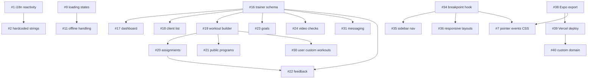

# Dependency Graph

## Dependency Chains

```
i18n:
  #1 (language reactivity) → #2 (hardcoded strings)

Web deployment:
  #34 (breakpoint hook) → #35 (sidebar nav), #36 (responsive layouts)
  #38 (Expo export) → #39 (Vercel deploy) → #40 (custom domain)
  #34 + #38 → #7 (pointer events CSS — web-specific, needs web build to test)

Trainer core:
  #16 (schema) → #17 (dashboard), #18 (client list), #19 (workout builder), #23 (goals), #24 (video checks), #31 (messaging)
  #19 (workout builder) → #20 (assignments), #21 (public programs), #30 (user custom workouts)
  #16 + #20 → #22 (feedback)

UX foundations:
  #9 (loading states) → #11 (offline/network error handling)
  #8 (testing infra) — independent but improves confidence for all other work
```

## Mermaid Diagram



## Independent Issues (no blockers)

These can be started at any time without waiting for other issues:

| # | Title | Priority |
|---|---|---|
| 1 | Language selection is not reactive | High |
| 3 | Workout saving is not atomic | High |
| 4 | "Forgot password" button does nothing | Medium |
| 5 | Home screen swallows stats errors | Medium |
| 6 | Remove unused App.tsx boilerplate | Low |
| 8 | Set up testing infrastructure | Medium |
| 9 | Loading states / skeleton screens | Medium |
| 10 | Input validation on auth forms | Medium |
| 12 | Edit Profile screen | Medium |
| 13 | Dark theme toggle | Low |
| 14 | Push notifications setup | Low |
| 15 | Help/Support and Terms pages | Low |
| 25 | AI-powered programming suggestions | Low |
| 26 | Nutrition logging | Low |
| 27 | Sleep and recovery tracking | Low |
| 28 | Gamification: challenges | Low |
| 29 | Gamification: achievements | Low |
| 34 | Responsive breakpoint hook | Highest |
| 38 | Expo static export config | Highest |

## Recommended Resolution Order

Work in phases. Within each phase, issues are listed in dependency order (do top ones first). Issues on the same line can be parallelized.

### Phase 1 — Critical Bugs + Web Foundation (do first)

| Order | Issue | Why |
|---|---|---|
| 1 | #1 — Language selection is not reactive | Blocks #2; core i18n is broken |
| 2 | #2 — Hardcoded Bulgarian strings | Depends on #1; completes i18n fix |
| 3 | #3 — Workout saving not atomic | Data integrity bug, independent |
| 4 | #34 — Responsive breakpoint hook | Foundation for all web layout work |
| 5 | #38 — Expo static export config | Foundation for deployment pipeline |

### Phase 2 — Web Deployment (ship it live)

| Order | Issue | Why |
|---|---|---|
| 6 | #35 — Desktop sidebar navigation | Depends on #34 |
| 7 | #36 — Responsive layout adjustments | Depends on #34; can parallel with #35 |
| 8 | #39 — Vercel deployment setup | Depends on #38 |
| 9 | #7 — Pointer events CSS fix | Web-specific, needs web build working |
| 10 | #40 — Custom domain setup | Depends on #39; last deployment step |

### Phase 3 — UX Polish + Stability

| Order | Issue | Why |
|---|---|---|
| 11 | #8 — Testing infrastructure | Improves confidence for trainer features |
| 12 | #9 — Loading states / skeleton screens | Better UX; enables #11 |
| 13 | #10 — Auth form validation | Independent UX improvement |
| 14 | #4 — Forgot password button | Independent bug fix |
| 15 | #5 — Home screen error swallowing | Independent bug fix |
| 16 | #11 — Offline / network error handling | Depends on #9 (needs loading states for graceful fallback) |
| 17 | #12 — Edit Profile screen | Independent feature |
| 18 | #6 — Remove unused App.tsx | Trivial cleanup |

### Phase 4 — Trainer Features

| Order | Issue | Why |
|---|---|---|
| 19 | #16 — Client-trainer schema + linking | Blocks all trainer features |
| 20 | #17 — Trainer dashboard | Depends on #16 |
| 21 | #18 — Client list + progress monitoring | Depends on #16; can parallel with #17 |
| 22 | #19 — Custom workout builder | Depends on #16 |
| 23 | #23 — Client goal setting | Depends on #16; can parallel with #19 |
| 24 | #20 — Workout assignment | Depends on #19 |
| 25 | #21 — Public workout programs | Depends on #19; can parallel with #20 |
| 26 | #22 — Workout feedback and notes | Depends on #16 + #20 |

### Phase 5 — Future / Low Priority

| Order | Issue | Why |
|---|---|---|
| 27 | #13 — Dark theme toggle | Nice to have |
| 28 | #14 — Push notifications | Infrastructure work |
| 29 | #15 — Help/Support pages | Content pages |
| 30 | #24 — Video form checks | Depends on #16 |
| 31 | #30 — User custom workouts | Depends on #19 |
| 32 | #31 — In-app messaging | Depends on #16 |
| 33 | #25 — AI programming suggestions | Future |
| 34 | #26 — Nutrition logging | Future |
| 35 | #27 — Sleep and recovery | Future |
| 36 | #28 — Gamification: challenges | Future |
| 37 | #29 — Gamification: achievements | Future |

## Notes

- **#37 (PWA config)** is already closed — implemented and merged.
- **#11 depends softly on #9**: offline handling needs loading/skeleton states to show graceful transitions. Without #9, offline errors would just be raw error text.
- **#7 (pointer events)** is web-only and only testable once `expo export --platform web` works (#38).
- **Phases 4-5 can overlap** with earlier phases if multiple people are working — trainer schema (#16) is independent of web deployment.
