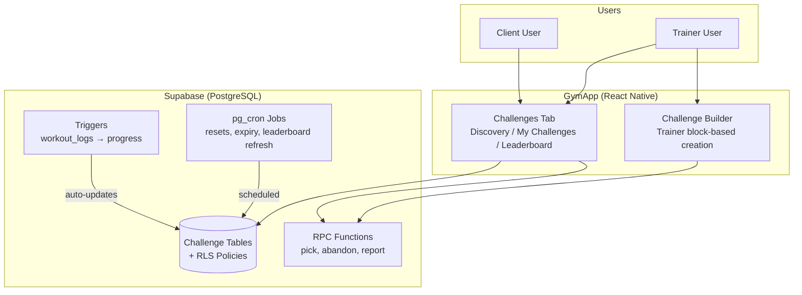
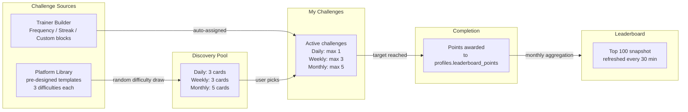
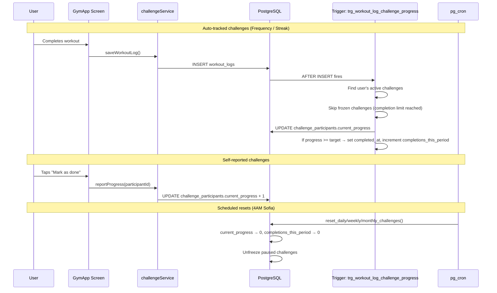
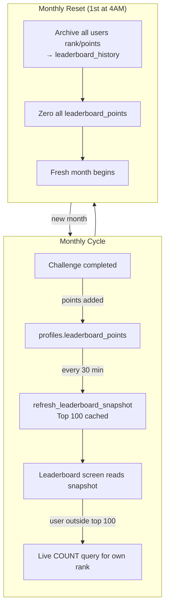
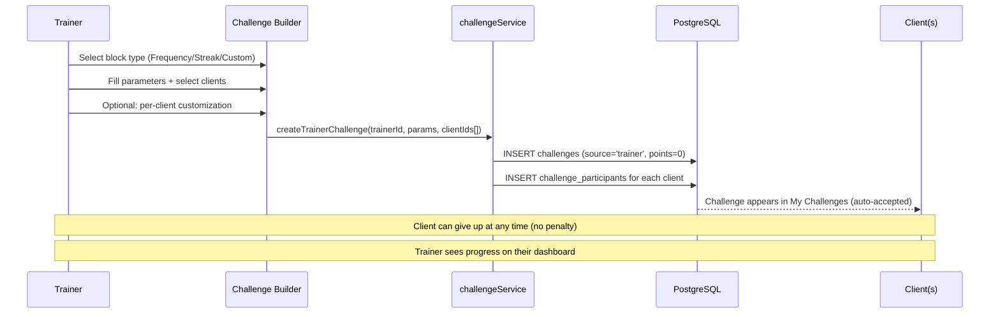

# Gamification: Challenges & Leaderboard

## Status: Design Complete — Ready for Implementation

Last updated: 2026-05-22

---

## Summary

A challenge system with two sources: **platform challenges** (pre-designed, rotating daily/weekly/monthly) and **trainer challenges** (assembled from pre-defined blocks, assigned to specific clients). A single global leaderboard tracks accumulated points from platform challenges only.

v1 ships the full infrastructure with an empty challenge library. Content (actual challenge titles, descriptions, point values) is populated in v1.2.

---

## Architecture

### System Context



### Challenge Data Flow



### Progress Tracking Flow



### Leaderboard Lifecycle



### Trainer Challenge Flow



---

## Challenge Types

Three types, all available in v1:

### Workout Frequency

- "Complete X workouts in the period" (any workout OR category-specific)
- Auto-tracked from `workout_logs`
- Requires workout categories (see Open Items)
- Examples: "Complete 3 workouts", "Complete 2 leg workouts this week"

### Streak

- "Work out X consecutive days"
- **Day boundary:** 4:00 AM to 4:00 AM Bulgarian time (EET/EEST)
- **Streak reset:** If broken, progress resets to 0 immediately at 4AM. User can restart within the same challenge period.
- **No backfill** — if they miss a day, it resets. No retroactive logging.
- **Weekly/monthly only** — no daily streak challenges
- Auto-tracked from `workout_logs`
- Example: "Maintain a 5-day workout streak this month"

### Custom Target

- Two sub-modes:
  - **Auto-tracked:** Challenge measures something from the app (e.g., "Complete 3 workouts") — app fills progress automatically, client cannot edit
  - **Self-reported:** Challenge measures something external (e.g., "Drink 2L water") — client reports via counter ("I did it") or numeric value input
- Trainer does NOT fill progress — client always does
- Trainer doesn't create free-form custom challenges — assembles from pre-defined blocks we provide

---

## Difficulty & Points

### Difficulty System

| Decision | Choice |
|----------|--------|
| Difficulty levels | **3 tiers**: Easy, Medium, Hard |
| How user gets difficulty | **Random from pool** — user does NOT choose. Each challenge template generates 3 variants in the pool. |
| Pool impact | Content pool is 3x larger (each concept × 3 difficulties). User still sees 3/3/5 cards in Discovery — random difficulty draws. |
| If user dislikes difficulty | Give up (no penalty), wait for 1h cooldown, get a new random draw |

### Point Values

| Decision | Choice |
|----------|--------|
| Base points per challenge | **Set individually at challenge creation time** — no fixed formula per cadence |
| Difficulty multiplier | Yes — harder variant of same challenge gives more points (exact multiplier set per challenge) |
| Who defines points | Platform admin when creating challenge templates |

### What Gives NO Points

| Scenario | Points |
|----------|--------|
| Trainer-assigned challenges | **0 pts** — leaderboard is purely platform-driven |
| Partial progress (period resets before completion) | **0 pts** — only completion counts |
| Rank/position bonus (first to complete) | **None** — everyone who completes gets the same |
| Streak bonus | **None** — streak is a separate mechanic |

---

## Discovery Mechanic

### Pool Sizes

| Cadence | Challenges visible | Replenish rule |
|---------|-------------------|----------------|
| Daily | 3 | When one is picked, a new one appears after 1h (blurred with countdown) |
| Weekly | 3 | Same — 1h cooldown per picked slot |
| Monthly | 5 | Same — 1h cooldown per picked slot |

### Active Limits (how many can be in My Challenges at once)

| Cadence | Active at a time |
|---------|-----------------|
| Daily | 1 |
| Weekly | 3 |
| Monthly | 5 |

### Completion Limits (total completions per period)

| Cadence | Max completions per period |
|---------|---------------------------|
| Daily | 1 per day |
| Weekly | 5 per week |
| Monthly | 10 per month |

### Discovery Card States

| State | Visual | Interaction |
|-------|--------|-------------|
| Available to pick | Normal card, tappable | Opens detail → Accept |
| 1h cooldown (slot just freed) | Blurred, not tappable | Bubble: "Available in XX:XX" (1h countdown) |
| Period limit reached | Blurred, not tappable | Bubble: "Available in X time" (countdown to next reset) |

### Anti-Repetition

Same challenge cannot reappear within the next 10 draws for that user. Challenges are otherwise repeatable across periods.

---

## Progress Tracking

### Hybrid Approach — Cached Progress, Trigger-Updated

| Mechanism | How |
|-----------|-----|
| `current_progress` column on `challenge_participants` | Cached value, updated by a Postgres trigger on `workout_logs` INSERT |
| Trigger scope | Fires for the user who logged the workout; updates only their active challenges (3-5 rows typical) |
| Frequency calculation | Simple COUNT of `workout_logs` rows in the challenge period (optionally filtered by category) |
| Streak calculation | Postgres function using gaps-and-islands on `gym_date`, called by the trigger |

### 4AM Day Boundary

A **stored generated column** on `workout_logs`:

```sql
ALTER TABLE workout_logs ADD COLUMN gym_date date
  GENERATED ALWAYS AS (
    (date_trunc('day', created_at AT TIME ZONE 'Europe/Sofia' - INTERVAL '4 hours'))::date
  ) STORED;

CREATE INDEX idx_workout_logs_gym_date ON workout_logs(user_id, gym_date);
```

- Computed once on INSERT, never recalculated
- Streak queries use `gym_date` directly — no runtime timezone math
- Indexed for fast lookups

### Period Resets

| Cadence | When | What happens |
|---------|------|--------------|
| Daily | Every day at 4AM (Europe/Sofia) | Active daily challenge progress resets to 0. Completion count resets. |
| Weekly | Every Monday at 4AM | All weekly challenges progress resets to 0. Completion count resets. Paused challenges become active. |
| Monthly | 1st of each month at 4AM | All monthly challenges progress resets to 0. Completion count resets. Paused challenges become active. |

Monthly reset uses `date_trunc('month', now()) + interval '1 month'` — handles variable month lengths automatically.

### Hard Freeze on Completion Limit

Once the completion limit is reached (1/1 daily, 5/5 weekly, 10/10 monthly), **all remaining active challenges of that cadence hard-freeze**:

- No progress is counted — even if the user performs the exact activity the challenge requires, it does NOT increment
- Newly picked challenges of that cadence also get zero progress until reset
- This is a **backend enforcement**, not just UI — the trigger on `workout_logs` skips progress updates for frozen challenges
- Applies equally to challenges that were mid-progress and freshly picked ones

**Example:** User has weekly challenge 1 (50% done) and challenge 2. They complete challenge 2 → that's 5/5 for the week. Challenge 1 freezes at 50% — workouts done between now and Monday 4AM won't count toward it. On Monday reset, progress resets to 0 and tracking resumes.

### Challenge Persistence

| Rule | Detail |
|------|--------|
| Expiry | **No expiry** — challenges stay in My Challenges until completed or user gives up |
| Give up | User can abandon any active challenge, no penalty. Does NOT count toward completion limit. |
| Pre-filling | User can pick challenges before the period resets. On reset, they wake up with fresh progress ready to go. |
| Progress on reset | **Always resets to 0** when a new period starts |
| No backfill | Missed activity is missed, no retroactive logging for any challenge type |

---

## Streak Reset UX — The Comeback Card

Turn streak breaks into a game mechanic, not a punishment.

### Streak Card States

| State | Visual | Trigger |
|-------|--------|---------|
| Normal (active) | Progress bar filled (e.g., "4/7 days"), standard styling | Streak is progressing |
| Broken (reset to 0) | Restart icon on card, message: "Day 0 — Restart your streak", "Best: X days" shown | 4AM passes with no workout logged previous day |
| Comeback moment | Inline checkmark animation + "Back on track!" text | `current_progress` reaches `longest_streak` value again |

### Longest Streak Tracking

| Decision | Choice |
|----------|--------|
| Storage | `longest_streak` column on `challenge_participants` |
| Updated when | `current_progress > longest_streak` |
| Display | Subtle text below progress bar: "Best: X days" |
| Persists | Across resets within the same challenge period |

### Comeback Moment

| Decision | Choice |
|----------|--------|
| Trigger | User's current streak reaches their previous longest streak for that challenge |
| Visual | Small inline animation: checkmark + "Back on track!" |
| Frequency | Once per streak attempt — doesn't fire again until next break + recovery |

### What's NOT Included

| Excluded | Reason |
|----------|--------|
| Push notifications for streak breaks | No guilt/spam |
| Modals or popups | Non-intrusive philosophy |
| Red/warning colors | Comeback framing is neutral-to-positive |
| Streak freeze / skip day | Not implementing — miss = reset |

---

## Leaderboard

### Structure

| Section | Content |
|---------|---------|
| Top 3 (podium) | Visual prominence — #1 center/elevated, #2 left, #3 right |
| #4–100 | Standard list layout |
| User's own rank | Always visible (even if outside top 100, shown at bottom) |
| Identity | Shows `profiles.name` — no anonymization, names are public |
| Trainers | Appear on leaderboard like any other user |

### Refresh & Performance

| Decision | Choice |
|----------|--------|
| Storage | `leaderboard_snapshot` table (top 100 cached) |
| Refresh cadence | Every 30 minutes via pg_cron |
| Points source | `profiles.leaderboard_points` column (updated on challenge completion) |
| User's own rank | On-demand: `SELECT COUNT(*) FROM profiles WHERE leaderboard_points > $my_points` (<1ms at 20k users) |
| Real-time updates | **None** — pull-based, refreshes on screen focus |

### Ranking & Tiebreaker

| Rule | Detail |
|------|--------|
| Primary sort | `leaderboard_points DESC` |
| Tiebreaker | `leaderboard_points_updated_at ASC` (whoever reached that point total first ranks higher) |
| Final tiebreaker | Alphabetical by `profiles.name` |
| No shared ranks | Every user gets a unique position |

### Monthly Reset

| Decision | Choice |
|----------|--------|
| Reset timing | **1st of each month at 4AM** (Europe/Sofia) |
| What resets | `profiles.leaderboard_points` → 0 for all users |
| Method | pg_cron bulk UPDATE (single statement, milliseconds even at 100k users) |
| All-time leaderboard | **No** — fresh start every month |
| Historical standings | User's own final rank + points archived per month in `leaderboard_history` |

### Celebration & Animation

| Rank | Animation Level |
|------|----------------|
| #1 | Largest confetti animation |
| #2–3 | Slightly smaller animation |
| #4–7 | Medium animation |
| #8–10 | Smallest animation |
| #11–100 | No animation |

- Trigger: Every time user opens/navigates to leaderboard while in top 10
- Dynamic: If user drops below top 10, animation stops
- Library: `react-native-confetti-cannon`
- No celebration modal on challenge completion — animation only on leaderboard

---

## Challenge Completion

### Trigger Mechanism

| Decision | Choice |
|----------|--------|
| What triggers completion | **pg_cron scheduled job** — runs every hour, finds challenges where `end_date < now()` and `status = 'active'` |
| Why not on-demand | No dependency on user action. If nobody opens a challenge, it still completes. |
| Delay tolerance | Up to 1 hour — acceptable since leaderboard already refreshes on 30-60 min cadence |

### `complete_challenge` RPC — Atomic Steps

1. Set `challenges.status = 'completed'`
2. Assign `challenge_participants.rank` using `ORDER BY current_progress DESC, completed_at ASC, user_id ASC`
3. For platform challenges: add points to `profiles.leaderboard_points` for all participants who completed (reached target)
4. Update `profiles.leaderboard_points_updated_at = now()` for affected users
5. No reward generation in v1 (deferred to v2)
6. No external API calls inside the transaction

### Ranking

| Rule | Detail |
|------|--------|
| Primary sort | `current_progress DESC` |
| Tiebreaker | `completed_at ASC` (whoever finished first) |
| Final tiebreaker | `user_id ASC` (deterministic) |
| No shared ranks | Every participant gets a unique rank |

**`completed_at` tracking:** When the trigger on `workout_logs` updates `current_progress` and detects `current_progress >= target_value`, it sets `challenge_participants.completed_at = now()`.

---

## Trainer Challenge Lifecycle

### Block-Based Builder

Trainers construct challenges by filling parameters into block structures:

| Block Type | Structure | Progress Tracking |
|------------|-----------|-------------------|
| Frequency | "Do **[X]** **[workout type]** workouts in **[X]** days" | Auto-tracked from `workout_logs` |
| Streak | "Maintain a streak of **[X]** consecutive days" | Auto-tracked from `workout_logs` |
| Custom | Trainer writes free-text goal | **Manual** — client has "Mark as done" button |

### Templates

| Decision | Choice |
|----------|--------|
| Save as template | Trainer can save any built challenge as a reusable template |
| Assign from template | Trainer picks a saved template, then edits parameters before confirming |
| Editable on assign | Duration, time, workout type, target value — anything in the block is customizable per client |

### Assignment Model

| Decision | Choice |
|----------|--------|
| Who assigns | Trainer selects specific clients |
| Multi-assign | Yes — trainer can select multiple clients at once |
| Per-client customization | Before confirming, trainer can tweak parameters for each client individually |
| Client discovery | No — only assigned clients see trainer challenges |

### Client Response

| Decision | Choice |
|----------|--------|
| Accept/reject | **Auto-accepted** — challenge appears in client's My Challenges immediately |
| Give up | Client can give up at any time, no penalty |

### Trainer Visibility

| Decision | Choice |
|----------|--------|
| Progress view | **Full visibility** — progress bars, completion times, rankings among assigned clients |
| Dashboard | Trainer sees all their assigned challenges with each client's progress |

### Deadline & Points

| Decision | Choice |
|----------|--------|
| Deadline | **Required** — trainer must set start/end date |
| Points | **Zero** — no leaderboard points, no rewards, no recognition |
| Purpose | Purely a trainer-client accountability tool |

---

## Enrollment & Visibility

### Enrollment Rules

| Decision | Choice |
|----------|--------|
| Platform challenges | Available to ALL users (including trainers). User picks from discovery pool. |
| Trainer challenges | Trainer assigns to specific client(s). Auto-assigned, client can give up. |
| Self-join | **Does not exist.** |
| Challenge history | **No completed challenges tab.** User sees only in-progress + discovery pool. |

### Visibility Rules

| Actor | Can see |
|-------|---------|
| User X | Their own in-progress challenges (platform + trainer-assigned) |
| User X | Discovery pool (available platform challenges to pick from) |
| User X | Their own points and rank (even if not in top 100) |
| User X | Top 100 leaderboard (names + points) |
| User X | **Cannot** see User Z's challenges, progress, or points (unless Z is in top 100) |
| Trainer Y | Challenges created by them, assigned to their own clients |
| Trainer Y | Their own platform challenges (as a user) |
| Trainer Y | **Cannot** see client's platform challenges |
| Trainer Y | **Cannot** see challenges created by other trainers |

---

## Navigation & UI Structure

### Tab Configuration

| Decision | Choice |
|----------|--------|
| Who sees the tab | **Everyone** — all users |
| Tab position | 5th tab |
| Tab icon | Trophy (`trophy` / `trophy-outline` from Ionicons) |
| Default view on tap | **My Challenges** |

### Sub-view Navigation

Three text-only toggle buttons at the top:

| Sub-view | Content |
|----------|---------|
| Discovery | Available platform challenges to pick from (daily/weekly/monthly pool) |
| My Challenges | User's active challenges (platform + trainer-assigned) |
| Leaderboard | Top 3 podium + list of #4–100 + user's own rank highlighted |

### Role-specific Content

| Role | Discovery | My Challenges | Leaderboard |
|------|-----------|---------------|-------------|
| Client | Platform challenges pool | Active platform + trainer-assigned | Same for all |
| Trainer (as user) | Same platform challenges pool | Their own active platform challenges | Same for all |
| Trainer (management) | — | Also shows challenges they assigned to clients | — |

### Screen Detail

#### Discovery View

- Sections: Daily / Weekly / Monthly
- Cards show title only (minimal)
- Tap → detail screen with title, description, countdown timer, difficulty badge, "Accept" button
- No type indicator (user doesn't see "Streak" / "Frequency" labels)

#### My Challenges View (no drill-down — all info inline)

| Element | Position |
|---------|----------|
| Title | Top |
| Description | Below title |
| Progress bar | Below description (e.g., "2/5 workouts") |
| Mark as complete button | Below progress bar (only for self-reported challenges) |
| Remaining time | Small bubble, bottom-right corner |

#### Paused State

Blurred card with bubble: "Available after [reset time]"

---

## Edge Cases

| # | Scenario | Decision |
|---|----------|----------|
| E1 | Trainer challenge deadline passes | Challenge disappears from client's My Challenges. Trainer sees it as "expired" on their dashboard. |
| E2 | Client gives up on trainer challenge | Trainer sees it as "abandoned" on their dashboard. No penalty for client. |
| E3 | Discovery pool — repetition | Same challenge cannot reappear within the next 10 draws for that user. Otherwise repeatable across periods. |
| E4 | Discovery pool — source | Pre-defined library created by platform. v1 ships with infrastructure only (empty library). Content populated in v1.2. |
| E5 | Give up vs. completion limit (daily) | Give up does NOT count toward completion limit. Only actual completions count. |
| E6 | Trainer-client connection severed | Trainer challenges disappear from client's My Challenges. Trainer sees them as "abandoned." |
| E7 | Trainer challenges in My Challenges UI | Mixed with platform challenges (no visual distinction in v1). |
| E8 | Self-reported challenges — who creates them | Both platform and trainers. Platform: from library. Trainers: via "Custom" block type. |

---

## Deferred to v2

| Topic | Description |
|-------|-------------|
| Badges/Trophies | Digital badges displayed on profile |
| Discount codes | Code generation, redemption flow, Stripe integration |
| Battle pass tiers | Milestone-based rewards within challenges |
| Profile rank history display | Monthly rank/points shown on user's profile |
| Hall of Fame | Historical monthly winners |
| Trainer challenge expiry behavior | Full behavior when deadline passes |
| Trainer rewards | Whether trainer challenges should have any reward system |
| Stripe integration | Real coupons, auto-apply at checkout, webhooks |
| Multi-provider abstraction | PaymentProvider interface for multiple providers |

---

## Implementation Structure Plan

---

### Database Schema

#### Migration: Core Tables

File: `supabase/migrations/20260XXX120000_challenges.sql`

**Table: `challenge_templates`** (platform challenge library)

| Column | Type | Notes |
|--------|------|-------|
| `id` | uuid | PK, `gen_random_uuid()` |
| `title` | text | NOT NULL |
| `title_bg` | text | Bulgarian translation |
| `description` | text | nullable |
| `description_bg` | text | nullable |
| `challenge_type` | text | `frequency`, `streak`, `custom_auto`, `custom_self_reported` |
| `cadence` | text | `daily`, `weekly`, `monthly` |
| `difficulty` | text | `easy`, `medium`, `hard` |
| `target_value` | integer | NOT NULL (e.g., 3 workouts, 5-day streak) |
| `points` | integer | NOT NULL — awarded on completion |
| `category` | text | nullable — workout category filter |
| `template_group` | text | NOT NULL — groups the 3 difficulty variants together |
| `active` | boolean | default true — allows deactivating without deletion |
| `created_at` | timestamptz | default `now()` |

**Table: `challenges`** (active challenge instances)

| Column | Type | Notes |
|--------|------|-------|
| `id` | uuid | PK |
| `template_id` | uuid | nullable FK → `challenge_templates` (null for trainer challenges) |
| `creator_id` | uuid | FK → `profiles` (trainer for trainer-created, null/system for platform) |
| `source` | text | `platform` or `trainer` |
| `title` | text | NOT NULL |
| `title_bg` | text | nullable |
| `description` | text | nullable |
| `description_bg` | text | nullable |
| `challenge_type` | text | `frequency`, `streak`, `custom_auto`, `custom_self_reported` |
| `cadence` | text | `daily`, `weekly`, `monthly` |
| `difficulty` | text | `easy`, `medium`, `hard` (null for trainer challenges) |
| `target_value` | integer | NOT NULL |
| `points` | integer | NOT NULL (0 for trainer challenges) |
| `category` | text | nullable — workout category filter |
| `start_date` | date | NOT NULL |
| `end_date` | date | nullable (null for platform challenges — they don't expire) |
| `status` | text | `active`, `completed`, `expired` |
| `created_at` | timestamptz | default `now()` |

**Table: `challenge_participants`** (user enrollment + progress)

| Column | Type | Notes |
|--------|------|-------|
| `id` | uuid | PK |
| `challenge_id` | uuid | FK → `challenges` |
| `user_id` | uuid | FK → `profiles` |
| `current_progress` | integer | default 0 — cached, updated by trigger |
| `longest_streak` | integer | default 0 — max streak achieved (for streak type) |
| `target_value` | integer | NOT NULL — copied from challenge (for per-client customization) |
| `status` | text | `active`, `completed`, `paused`, `abandoned` |
| `joined_at` | timestamptz | default `now()` |
| `completed_at` | timestamptz | nullable — set when `current_progress >= target_value` |
| `rank` | integer | nullable — set on challenge completion |
| `source` | text | `discovery`, `trainer_assigned` |
| `created_at` | timestamptz | default `now()` |

**Table: `user_challenge_state`** (discovery/completion tracking per user)

| Column | Type | Notes |
|--------|------|-------|
| `id` | uuid | PK |
| `user_id` | uuid | FK → `profiles` |
| `cadence` | text | `daily`, `weekly`, `monthly` |
| `completions_this_period` | integer | default 0 |
| `period_start` | date | NOT NULL — current period start date |
| `last_pick_at` | timestamptz | nullable — for 1h cooldown calculation |
| `recent_template_ids` | uuid[] | last 10 picked template IDs (for anti-repetition) |

**Table: `trainer_challenge_templates`** (saved trainer blocks)

| Column | Type | Notes |
|--------|------|-------|
| `id` | uuid | PK |
| `trainer_id` | uuid | FK → `profiles` |
| `title` | text | NOT NULL |
| `challenge_type` | text | `frequency`, `streak`, `custom` |
| `target_value` | integer | NOT NULL |
| `category` | text | nullable |
| `description` | text | nullable |
| `created_at` | timestamptz | default `now()` |

**Table: `leaderboard_snapshot`** (cached top 100)

| Column | Type | Notes |
|--------|------|-------|
| `id` | uuid | PK |
| `user_id` | uuid | FK → `profiles` |
| `rank` | integer | NOT NULL |
| `points` | integer | NOT NULL |
| `user_name` | text | NOT NULL — denormalized for fast reads |
| `refreshed_at` | timestamptz | NOT NULL |

**Table: `leaderboard_history`** (monthly archives)

| Column | Type | Notes |
|--------|------|-------|
| `id` | uuid | PK |
| `user_id` | uuid | FK → `profiles` |
| `month` | date | 1st of the month (e.g., `2026-06-01`) |
| `final_rank` | integer | NOT NULL |
| `final_points` | integer | NOT NULL |
| `created_at` | timestamptz | default `now()` |

#### Columns on Existing Tables

**`profiles` table additions:**

| Column | Type | Notes |
|--------|------|-------|
| `leaderboard_points` | integer | default 0 |
| `leaderboard_points_updated_at` | timestamptz | default `now()` |

**`workout_logs` table additions:**

| Column | Type | Notes |
|--------|------|-------|
| `gym_date` | date | GENERATED ALWAYS AS stored (4AM boundary formula) |

#### Indexes

```sql
CREATE INDEX idx_workout_logs_gym_date ON workout_logs(user_id, gym_date);
CREATE INDEX idx_profiles_leaderboard_points ON profiles(leaderboard_points DESC);
CREATE INDEX idx_challenge_participants_active ON challenge_participants(user_id, status) WHERE status = 'active';
CREATE INDEX idx_challenge_participants_challenge ON challenge_participants(challenge_id, status);
CREATE INDEX idx_challenges_status ON challenges(status, cadence);
CREATE INDEX idx_user_challenge_state ON user_challenge_state(user_id, cadence);
```

#### RLS Policies

| Table | Policy | Rule |
|-------|--------|------|
| `challenge_templates` | SELECT | All authenticated users |
| `challenges` | SELECT | Participants can read their own + trainers read their created ones |
| `challenges` | INSERT | Trainers only (source = 'trainer') |
| `challenge_participants` | SELECT | Own rows + trainer sees their assigned clients |
| `challenge_participants` | INSERT | Own user_id only (for discovery picks) |
| `challenge_participants` | UPDATE | Own rows (for abandon/self-report) |
| `user_challenge_state` | SELECT/UPDATE | Own rows only |
| `trainer_challenge_templates` | ALL | Own rows only (trainer_id = auth.uid()) |
| `leaderboard_snapshot` | SELECT | All authenticated users |
| `leaderboard_history` | SELECT | Own rows only |

---

### Postgres Functions & Triggers

**Trigger: `trg_workout_log_challenge_progress`** (on `workout_logs` INSERT)

Responsibilities:
1. Find all `active` challenge_participants for the user
2. Skip challenges that are frozen (user's `completions_this_period >= limit` for that cadence)
3. For frequency challenges: increment `current_progress` if workout matches category (or any workout if no category)
4. For streak challenges: recalculate streak using gaps-and-islands on `gym_date`
5. Update `longest_streak` if `current_progress > longest_streak`
6. If `current_progress >= target_value`: set `completed_at = now()`, update `user_challenge_state.completions_this_period`

**Function: `calculate_streak(p_user_id uuid, p_challenge_id uuid)`**

- Queries `workout_logs` for the user within the challenge period
- Uses gaps-and-islands on `gym_date` to find current consecutive day count
- Returns integer (current streak length)

**Function: `refresh_leaderboard_snapshot()`** (called by pg_cron)

- Truncates `leaderboard_snapshot`
- Inserts top 100 from `profiles` ordered by `leaderboard_points DESC, leaderboard_points_updated_at ASC, name ASC`
- Updates `refreshed_at`

**Function: `complete_expired_challenges()`** (called by pg_cron, hourly)

- Finds challenges where `end_date < now()` AND `status = 'active'` (trainer challenges only — platform challenges don't expire)
- Assigns ranks per `current_progress DESC, completed_at ASC, user_id ASC`
- Sets `challenges.status = 'completed'`

**Function: `reset_daily_challenges()`** (called by pg_cron, daily at 4AM Sofia)

- Resets `current_progress = 0` for all active daily challenge participants
- Resets `user_challenge_state.completions_this_period = 0` WHERE `cadence = 'daily'`
- Updates `period_start` to today's gym_date

**Function: `reset_weekly_challenges()`** (called by pg_cron, Monday 4AM Sofia)

- Same as daily but for weekly cadence
- Unpauses paused weekly challenges (`status = 'paused'` → `'active'`)

**Function: `reset_monthly_challenges()`** (called by pg_cron, 1st of month 4AM Sofia)

- Same pattern for monthly cadence
- Also runs the leaderboard monthly reset:
  - Archives each user's rank/points to `leaderboard_history`
  - Zeros `profiles.leaderboard_points` for all users
  - Resets `leaderboard_snapshot`

---

### Scheduled Jobs (pg_cron)

| Job | Schedule | Function |
|-----|----------|----------|
| Leaderboard refresh | Every 30 min | `refresh_leaderboard_snapshot()` |
| Challenge expiry | Every hour | `complete_expired_challenges()` |
| Daily reset | `0 1 * * *` (4AM Sofia = 1AM UTC in summer) | `reset_daily_challenges()` |
| Weekly reset | `0 1 * * 1` (Monday 4AM Sofia) | `reset_weekly_challenges()` |
| Monthly reset | `0 1 1 * *` (1st of month 4AM Sofia) | `reset_monthly_challenges()` |

> Note: UTC offset for Sofia changes between winter (UTC+2) and summer (UTC+3). Cron times must be set to the current UTC equivalent of 4AM Sofia, or use a timezone-aware scheduler.

---

### Service Layer

File: `src/lib/challengeService.ts`

#### Discovery Functions

| Function | Purpose |
|----------|---------|
| `getDiscoveryPool(userId, cadence)` | Returns available challenges for the discovery view (respects anti-repetition, cooldown, limits) |
| `pickChallenge(userId, challengeTemplateId)` | User picks a challenge from discovery → creates `challenge_participants` row |
| `getUserChallengeState(userId)` | Returns completion counts, cooldown status, active counts per cadence |

#### My Challenges Functions

| Function | Purpose |
|----------|---------|
| `getActiveChallenges(userId)` | Returns all active challenges (platform + trainer) with progress |
| `abandonChallenge(userId, challengeParticipantId)` | User gives up on a challenge |
| `reportProgress(userId, challengeParticipantId)` | Self-reported challenges: increment progress by 1 |

#### Leaderboard Functions

| Function | Purpose |
|----------|---------|
| `getLeaderboard()` | Returns top 100 from snapshot table |
| `getUserRank(userId)` | Returns user's current rank + points (even if outside top 100) |
| `getLeaderboardHistory(userId)` | Returns user's monthly rank history |

#### Trainer Functions

| Function | Purpose |
|----------|---------|
| `createTrainerChallenge(trainerId, params, clientIds[])` | Creates challenge + participant rows for each client |
| `getTrainerChallenges(trainerId)` | All challenges created by trainer with client progress |
| `getTrainerTemplates(trainerId)` | Saved block templates |
| `saveTrainerTemplate(trainerId, params)` | Save a challenge block as reusable template |
| `deleteTrainerTemplate(trainerId, templateId)` | Remove a saved template |

---

### TypeScript Types

File: `src/types/index.ts` (additions)

```typescript
interface ChallengeTemplate {
  id: string;
  title: string;
  titleBg: string | null;
  description: string | null;
  descriptionBg: string | null;
  challengeType: 'frequency' | 'streak' | 'custom_auto' | 'custom_self_reported';
  cadence: 'daily' | 'weekly' | 'monthly';
  difficulty: 'easy' | 'medium' | 'hard';
  targetValue: number;
  points: number;
  category: string | null;
  templateGroup: string;
}

interface Challenge {
  id: string;
  templateId: string | null;
  source: 'platform' | 'trainer';
  title: string;
  titleBg: string | null;
  description: string | null;
  descriptionBg: string | null;
  challengeType: 'frequency' | 'streak' | 'custom_auto' | 'custom_self_reported';
  cadence: 'daily' | 'weekly' | 'monthly';
  difficulty: 'easy' | 'medium' | 'hard' | null;
  targetValue: number;
  points: number;
  category: string | null;
  status: 'active' | 'completed' | 'expired';
  startDate: string;
  endDate: string | null;
}

interface ChallengeParticipant {
  id: string;
  challengeId: string;
  userId: string;
  currentProgress: number;
  longestStreak: number;
  targetValue: number;
  status: 'active' | 'completed' | 'paused' | 'abandoned';
  completedAt: string | null;
  source: 'discovery' | 'trainer_assigned';
  challenge: Challenge;
}

interface DiscoveryCard {
  challenge: Challenge;
  state: 'available' | 'cooldown' | 'limit_reached';
  availableAt: string | null;
}

interface UserChallengeState {
  cadence: 'daily' | 'weekly' | 'monthly';
  completionsThisPeriod: number;
  maxCompletions: number;
  activeCount: number;
  maxActive: number;
  lastPickAt: string | null;
  cooldownEndsAt: string | null;
}

interface LeaderboardEntry {
  rank: number;
  userId: string;
  userName: string;
  points: number;
}

interface TrainerChallengeTemplate {
  id: string;
  trainerId: string;
  title: string;
  challengeType: 'frequency' | 'streak' | 'custom';
  targetValue: number;
  category: string | null;
  description: string | null;
}
```

---

### UI Screens & Components

#### Tab Navigation

File: `app/(tabs)/_layout.tsx`

- Add 5th tab: **Challenges**
- Icon: `trophy-outline` / `trophy` (Ionicons)
- Route: `app/(tabs)/challenges.tsx`

#### Challenges Tab Screen

File: `app/(tabs)/challenges.tsx`

- Three-way text toggle: **Discovery** | **My Challenges** | **Leaderboard**
- Default sub-view: **My Challenges**
- Conditional render within same screen (not separate routes)

#### Discovery Sub-view

Component: `src/components/challenges/DiscoveryView.tsx`

- Three sections: Daily / Weekly / Monthly
- Pool cards (3/3/5)
- States: available (tappable), cooldown (blurred + countdown), limit reached (blurred + countdown)
- Tap available card → navigate to detail screen

#### Challenge Detail Screen

File: `app/challenge-detail.tsx`

- Title, description, remaining time countdown, difficulty badge
- "Accept" button → `pickChallenge()` → navigates back to My Challenges
- Only accessible from Discovery

#### My Challenges Sub-view

Component: `src/components/challenges/MyChallengesView.tsx`

- FlatList of active challenges (platform + trainer mixed)
- Each card: title, description, progress bar, remaining time bubble
- Self-reported: "Mark as done" button
- Streak broken: Comeback Card UI (restart icon, "Day 0 — Restart your streak", "Best: X days")
- Paused: blurred with "Available after [reset time]" bubble
- Swipe or long-press for "Give up"

#### Leaderboard Sub-view

Component: `src/components/challenges/LeaderboardView.tsx`

- Top 3: podium visual
- #4–100: standard FlatList
- Current user highlighted (different background)
- Own rank always visible at bottom if outside top 100
- Top 10: confetti (`react-native-confetti-cannon`, tiered)

#### Trainer Challenge Builder

File: `app/challenge-builder.tsx`

- Block selection: Frequency / Streak / Custom
- Parameter inputs per block type
- Client multi-select picker
- Per-client customization step
- Start/end date pickers
- "Save as template" toggle
- "Assign" button → `createTrainerChallenge()`

#### Trainer Challenge Management

File: `app/trainer-challenges.tsx`

- List of all trainer-created challenges
- Client progress per challenge (name + progress bar + status)
- Expired/completed shown separately

---

### i18n Strings

File: `src/constants/translations.ts` (additions)

Required key groups:
- `challenges.discovery` — "Discovery", pool section headers, cooldown text, limit text
- `challenges.myChallenges` — "My Challenges", progress labels, give up confirmation
- `challenges.leaderboard` — "Leaderboard", rank labels, monthly reset notice
- `challenges.detail` — "Accept", remaining time format, difficulty labels
- `challenges.streak` — "Day X", "Restart your streak", "Best: X days", "Back on track!"
- `challenges.trainer` — builder labels, template save, assign button, progress view
- `challenges.states` — "Available in...", "Paused", "Completed", "Abandoned"
- `tab.challenges` — tab label

All strings in EN + BG.

---

### Implementation Sequence (PR Order)

| # | PR Scope | Depends On |
|---|----------|------------|
| 1 | Database migration: all tables, columns, indexes | — |
| 2 | RLS policies | PR 1 |
| 3 | Postgres functions: streak calculation, progress trigger | PR 1 |
| 4 | Postgres functions: reset functions, leaderboard refresh, challenge expiry | PR 3 |
| 5 | pg_cron job setup | PR 4 |
| 6 | TypeScript types | — |
| 7 | Service layer: discovery functions | PR 1, 6 |
| 8 | Service layer: my challenges + leaderboard functions | PR 1, 6 |
| 9 | Service layer: trainer functions | PR 1, 6 |
| 10 | Tab navigation: add 5th tab (Challenges) | PR 6 |
| 11 | UI: Discovery sub-view + challenge detail screen | PR 7, 10 |
| 12 | UI: My Challenges sub-view (including Comeback Card) | PR 8, 10 |
| 13 | UI: Leaderboard sub-view (including confetti) | PR 8, 10 |
| 14 | UI: Trainer challenge builder | PR 9, 10 |
| 15 | UI: Trainer challenge management view | PR 9, 10 |
| 16 | i18n: all EN + BG strings | PR 11–15 |
| 17 | Workout categories (prerequisite for category-filtered challenges) | — |

---

### Open Items (Post-Review)

| Item | Needed Before |
|------|---------------|
| Workout categories (Topic 25) | Content library (v1.2) — category-filtered challenges need this |
| Challenge content library | v1.2 — actual challenge titles, descriptions, point values |
| pg_cron timezone handling | PR 5 — hardcode UTC offset or use timezone-aware approach |
| Confetti library evaluation | PR 13 — test `react-native-confetti-cannon` on iOS/Android |
| Discovery pool randomization seed | PR 7 — pure random vs. weighted draws |

---

## Reference: Georgi's Original Design

See `Documentation/issue-28-challenges-design-draft.md` for the initial brainstorm that this document builds upon. Key differences from Georgi's original:

- No client-created challenges (Georgi assumed trainer-only, we added platform challenges)
- Leaderboard is global across all users, not per-challenge
- Trainer challenges don't award leaderboard points
- Discovery/rotation mechanic for platform challenges (not in original)
- Pre-defined blocks for trainer challenge creation (not free-form)
