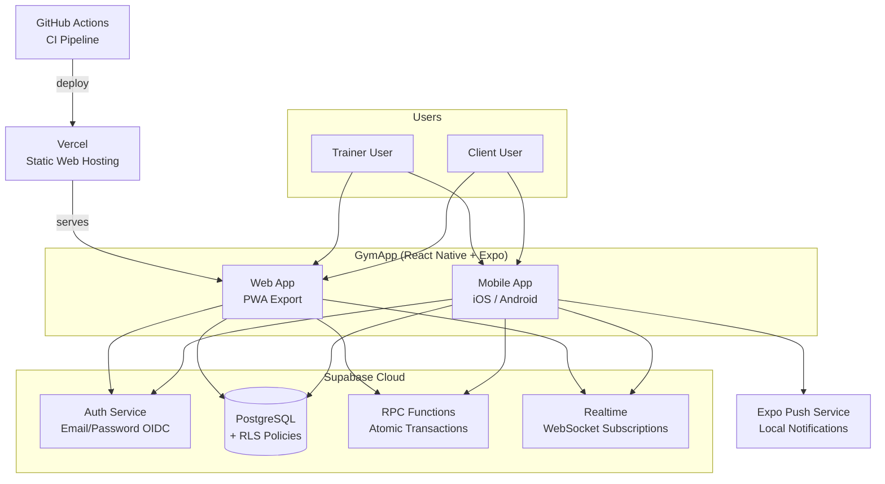
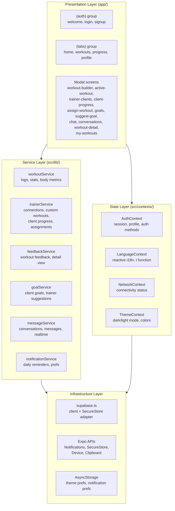
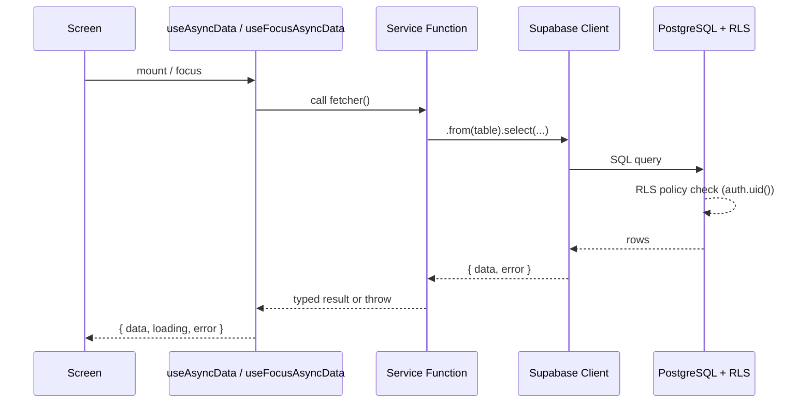
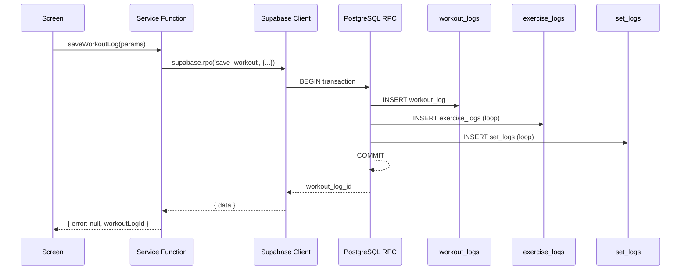
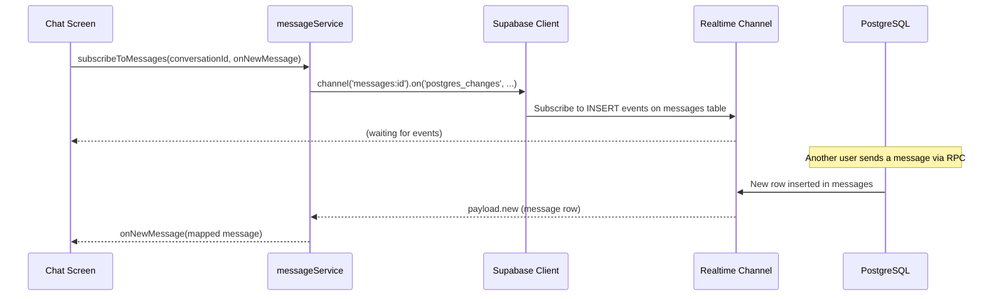

# GymApp Architecture

## Overview

GymApp is a bilingual (Bulgarian/English) mobile fitness application that connects personal trainers with their clients. The app tracks workouts, logs sets/reps/weights, monitors streaks, provides progress analytics, supports trainer-client messaging, goal tracking, and workout assignments.

**Trainer Model:** Hybrid — trainers can manage individual clients (1-to-1 personal coaching) AND publish programs that any user can follow (1-to-many public content).

## Tech Stack

| Layer | Technology | Version |
|-------|-----------|---------|
| Framework | React Native | 0.81.5 |
| Platform SDK | Expo | SDK 54 |
| Router | expo-router | v6 |
| Language | TypeScript | 5.9 (strict) |
| Backend | Supabase | Auth + PostgreSQL + Realtime |
| Security | Row Level Security | Enforced on all tables |
| Icons | @expo/vector-icons | Ionicons |
| State | React Context | + local component state |

## System Context



## Component Architecture



## Data Flow

### Read Flow



### Atomic Write Flow (via RPC)



### Realtime Flow (Messaging)



## External Dependencies

| Package | Purpose | Runtime? |
|---------|---------|----------|
| `@supabase/supabase-js` | Auth, database queries, RPC calls, Realtime | Yes |
| `expo-notifications` | Local daily workout reminders | Yes |
| `expo-secure-store` | Secure token persistence (native) | Yes |
| `expo-device` | Physical device check for notifications | Yes |
| `expo-clipboard` | Copy invite codes | Yes |
| `expo-image` | Optimized image display | Yes |
| `expo-linear-gradient` | UI gradient backgrounds | Yes |
| `@react-native-community/netinfo` | Network connectivity detection | Yes |
| `@react-native-async-storage/async-storage` | Theme + notification preferences | Yes |
| `react-native-gesture-handler` | Navigation gestures | Yes |
| `react-native-reanimated` | Animations and transitions | Yes |
| `react-native-safe-area-context` | Safe area insets | Yes |

## Project Structure

```
GymApp/
├── app/                          # expo-router file-based screens
│   ├── _layout.tsx               # Root layout (AuthProvider + auth guard)
│   ├── index.tsx                 # Entry redirect
│   ├── (auth)/                   # Auth route group (unauthenticated)
│   │   ├── _layout.tsx
│   │   ├── welcome.tsx
│   │   ├── login.tsx
│   │   └── signup.tsx
│   ├── (tabs)/                   # Main tab group (authenticated clients)
│   │   ├── _layout.tsx           # Tab bar configuration
│   │   ├── index.tsx             # Home screen
│   │   ├── workouts.tsx          # Workout list
│   │   ├── progress.tsx          # Progress/analytics
│   │   └── profile.tsx           # User profile
│   ├── workout/[id].tsx          # Workout detail (pre-start)
│   ├── active-workout/[id].tsx   # Active workout session
│   ├── assign-workout.tsx        # Trainer assigns workouts to clients
│   ├── chat.tsx                  # Chat screen with pagination + realtime
│   ├── client-progress.tsx       # Trainer views client progress
│   ├── conversations.tsx         # Conversation list
│   ├── edit-profile.tsx          # Edit profile screen
│   ├── goals.tsx                 # Client goal setting/tracking
│   ├── my-trainer.tsx            # Client views their trainer
│   ├── my-workouts.tsx           # User's custom workouts
│   ├── suggest-goal.tsx          # Trainer suggests goals to clients
│   ├── trainer-clients.tsx       # Trainer client management
│   ├── workout-builder.tsx       # Custom workout creator
│   └── workout-detail.tsx        # Workout detail with trainer feedback
├── src/
│   ├── constants/
│   │   ├── theme.ts              # Design system tokens
│   │   ├── responsive.ts         # Breakpoints + container styles
│   │   └── i18n.ts               # Translation strings + t() function
│   ├── contexts/
│   │   ├── AuthContext.tsx        # Global auth state provider
│   │   ├── LanguageContext.tsx    # Reactive i18n provider
│   │   ├── NetworkContext.tsx     # Connectivity monitoring
│   │   └── ThemeContext.tsx       # Dark/light mode
│   ├── lib/
│   │   ├── supabase.ts           # Supabase client initialization
│   │   ├── workoutService.ts     # Workout data access functions
│   │   ├── trainerService.ts     # Trainer connections, custom workouts, assignments
│   │   ├── feedbackService.ts    # Workout feedback + detail view
│   │   ├── goalService.ts        # Client goals + trainer suggestions
│   │   ├── messageService.ts     # In-app messaging + realtime
│   │   ├── notificationService.ts # Local notification management
│   │   ├── confirm.ts            # Platform-aware confirmation dialog
│   │   └── formatDate.ts         # Date formatting utility
│   ├── hooks/
│   │   ├── useAsyncData.ts       # Generic data fetching hook
│   │   ├── useBreakpoint.ts      # Responsive breakpoint detection
│   │   ├── useOfflineGuard.ts    # Offline action prevention
│   │   └── useWorkoutBuilderForm.ts # Custom workout form state
│   ├── components/
│   │   ├── ErrorCard.tsx          # Error display with retry button
│   │   ├── ExerciseFormCard.tsx   # Exercise input card for workout builder
│   │   ├── OfflineBanner.tsx      # Animated offline indicator
│   │   ├── ResponsiveContainer.tsx # Width-constrained responsive wrapper
│   │   ├── Sidebar.tsx            # Desktop navigation sidebar
│   │   └── SkeletonLoader.tsx     # Animated loading placeholders
│   ├── data/
│   │   └── workouts.ts           # Sample workout data
│   └── types/
│       ├── index.ts              # Shared TypeScript types
│       └── database.ts           # Generated Supabase types
├── supabase/
│   └── migrations/               # Timestamped SQL migration files
├── Documentation/                # App documentation
├── docs/plans/                   # Implementation plans
├── app.json                      # Expo configuration
├── package.json                  # Dependencies
└── tsconfig.json                 # TypeScript configuration
```

## Navigation Architecture

GymApp uses **expo-router v6** with file-based routing and layout groups.

### Route Groups

| Group | Purpose | Access |
|-------|---------|--------|
| `(auth)` | Welcome, login, signup | Unauthenticated only |
| `(tabs)` | Main app tab bar | Authenticated only |
| `workout/[id]` | Workout detail modal | Authenticated |
| `active-workout/[id]` | Active session (gesture disabled) | Authenticated |

### Auth Guard

The root `_layout.tsx` implements an auth guard using `useSegments()` and `useRouter()`:

```
User opens app
  -> loading? -> Show spinner
  -> No session + not in (auth)? -> Redirect to /(auth)/welcome
  -> Has session + in (auth)? -> Redirect to /(tabs)
  -> Otherwise -> Render current route
```

### Tab Bar

Role-conditional tabs using `Ionicons`. Tabs are shown/hidden via `href: null` based on `profile.role`:

**Client tabs:**

| Tab | Icon | Screen |
|-----|------|--------|
| Home | `home` | Dashboard with stats |
| Workouts | `barbell` | Workout list |
| Progress | `stats-chart` | Analytics + body metrics |
| Profile | `person` | User settings |

**Trainer tabs:**

| Tab | Icon | Screen |
|-----|------|--------|
| Dashboard | `grid` | Trainer dashboard (clients, activity) |
| Profile | `person` | User settings |

### Conditional Navigation

The tab layout conditionally renders based on `profile.role`:
- **Client tabs:** Home, Workouts, Progress, Profile
- **Trainer tabs:** Dashboard, Profile

Tabs are hidden per role using the `href: null` pattern on `<Tabs.Screen>` options — all screens are defined once but only the relevant ones render in the tab bar.

### Desktop Layout (Responsive)

On the `lg` breakpoint (1024px+), the tab bar is hidden and replaced by a persistent **Sidebar** component (`src/components/Sidebar.tsx`, 240px wide). The sidebar renders role-aware navigation items:
- **Client:** Home, Workouts, Progress, Messages, Profile
- **Trainer:** Dashboard, Messages, Profile

The `(tabs)/_layout.tsx` checks `useBreakpoint() === 'lg'` and conditionally renders the Sidebar alongside the content area, setting `tabBarStyle: { display: 'none' }` on desktop.

## Authentication

### Provider

Supabase Auth with email/password. The `AuthProvider` wraps the entire app and exposes:

```typescript
interface AuthContextType {
  session: Session | null;
  user: User | null;
  profile: Profile | null;
  loading: boolean;
  signUp(email, password, name, role): Promise<{ error }>
  signIn(email, password): Promise<{ error }>
  signOut(): Promise<void>
  refreshProfile(): Promise<void>
}
```

### Profile Interface

```typescript
interface Profile {
  id: string;
  name: string;
  email: string;
  role: 'client' | 'trainer';
  language: 'bg' | 'en';
  trainer_code: string | null;  // 6-char permanent code (trainers only)
  weight: number | null;
  height: number | null;
  goal: string | null;
  avatar_url: string | null;
}
```

### Session Persistence

- **Native (iOS/Android):** `expo-secure-store` via `ExpoSecureStoreAdapter`
- **Web:** `localStorage` fallback
- Supabase handles token refresh automatically via `onAuthStateChange`

### Role Selection

Users choose their role (client/trainer) during signup. The role is passed via `options.data` in `supabase.auth.signUp()` and the `handle_new_user()` trigger copies it to the `profiles` table. For trainers, a unique `trainer_code` is also auto-generated.

## State Management

**Pattern:** React Context + local component state. No external state library (Redux, Zustand, etc.).

- **Global state:** `AuthContext` — session, user profile, auth methods
- **Screen state:** `useState` + `useCallback` for data fetching
- **No caching layer** — data is fetched fresh on each screen mount

### Data Flow

```
Screen mounts
  -> useEffect calls service function
  -> Service function queries Supabase
  -> setState with results
  -> UI re-renders
```

## Data Access Layer

All database operations go through service files in `src/lib/`:

### `workoutService.ts`

| Function | Purpose |
|----------|---------|
| `saveWorkoutLog()` | Save completed workout with exercises and sets (via RPC) |
| `getWorkoutHistory()` | Fetch user's completed workouts |
| `getWorkoutStats()` | Calculate streak, weekly count, total |
| `getExerciseHistory()` | Get history for a specific exercise |
| `saveBodyMetric()` | Upsert daily body weight |
| `getBodyMetrics()` | Fetch weight history |

### `trainerService.ts`

| Function | Purpose |
|----------|---------|
| `getTrainerCode()` | Get trainer's permanent invite code from profile |
| `redeemInviteCode()` | Client redeems code, creates pending connection |
| `getTrainerClients()` | Get trainer's active connected clients |
| `getPendingRequests()` | Get pending (client-confirmed) connection requests |
| `getClientTrainer()` | Get client's current trainer connection |
| `removeConnection()` | Either party removes the connection |
| `confirmConnection()` | Client confirms connection via RPC |
| `approveConnection()` | Trainer approves pending connection via RPC |
| `rejectConnection()` | Trainer rejects pending connection via RPC |
| `getCustomWorkouts()` | List custom workout templates |
| `getCustomWorkout()` | Get single custom workout by ID |
| `createCustomWorkout()` | Create new custom workout |
| `updateCustomWorkout()` | Update existing custom workout fields |
| `deleteCustomWorkout()` | Delete a custom workout |
| `getClientProfile()` | Get client profile (trainer access via RLS) |
| `getClientWorkoutLogs()` | Get client's workout history (trainer access) |
| `getClientBodyMetrics()` | Get client's body metrics (trainer access) |
| `getClientProgress()` | Full aggregated client progress data |
| `getRecentClientActivity()` | Recent workout activity across all clients |
| `assignWorkout()` | Assign a custom workout to a client |
| `unassignWorkout()` | Remove a workout assignment |
| `getTrainerAssignments()` | Get assignments created by a trainer |
| `getClientAssignments()` | Get assignments for a client |
| `completeAssignment()` | Mark an assignment as completed |

### `feedbackService.ts`

| Function | Purpose |
|----------|---------|
| `getWorkoutDetail()` | Full workout log with exercises, sets, and feedback |
| `getWorkoutFeedback()` | Get all feedback for a workout log |
| `addWorkoutFeedback()` | Trainer adds feedback to a workout log |

### `goalService.ts`

| Function | Purpose |
|----------|---------|
| `getClientGoals()` | Get all goals for a client |
| `createGoal()` | Client creates a new goal |
| `updateGoal()` | Update goal fields |
| `deleteGoal()` | Delete a goal |
| `completeGoal()` | Mark goal as completed |
| `getPendingSuggestions()` | Get pending trainer suggestions for a client |
| `respondToSuggestion()` | Client accepts/adjusts/rejects a suggestion |
| `getClientGoalsForTrainer()` | Trainer views client's active goals |
| `suggestGoal()` | Trainer suggests a new goal |
| `suggestAdjustment()` | Trainer suggests adjustment to existing goal |
| `withdrawSuggestion()` | Trainer withdraws a pending suggestion |
| `refreshGoalProgress()` | Auto-update current values from workout/weight data |

### `messageService.ts`

| Function | Purpose |
|----------|---------|
| `getOrCreateConversation()` | Find or create a conversation with another user (via RPC) |
| `getConversations()` | Get all conversations with last message + unread count (via RPC) |
| `getTotalUnreadCount()` | Get total unread messages across all conversations |
| `getMessages()` | Get messages for a conversation (paginated) |
| `sendMessage()` | Send a message via RPC |
| `markMessagesRead()` | Mark all unread messages as read via RPC |
| `subscribeToMessages()` | Subscribe to realtime new messages via Supabase Realtime |

### `notificationService.ts`

| Function | Purpose |
|----------|---------|
| `requestNotificationPermission()` | Request OS notification permission |
| `getNotificationPreferences()` | Load prefs from AsyncStorage |
| `saveNotificationPreferences()` | Persist prefs to AsyncStorage |
| `scheduleDailyReminder()` | Schedule daily workout reminder |
| `cancelDailyReminder()` | Cancel scheduled reminder |
| `toggleNotifications()` | Enable/disable with permission handling |
| `updateReminderTime()` | Reschedule at new time |
| `addNotificationResponseListener()` | Handle notification taps |

### `supabase.ts`

Initializes the Supabase client with:
- Project URL + anon key from environment variables
- Custom `ExpoSecureStoreAdapter` for token storage
- **Dev proxy fallback:** If env vars are missing, uses a local proxy URL for development without Supabase credentials

## Key Screens

### Home (`(tabs)/index.tsx`)

Greeting, today's workout card, quick stats (streak/weekly/total), weekly goal progress bar.

### Workouts (`(tabs)/workouts.tsx`)

List of available workouts from sample data. Each card shows name, duration, difficulty, exercise count.

### Active Workout (`active-workout/[id].tsx`)

Real-time workout session. Timer, exercise list with sets to complete, weight/reps input per set, completion tracking. Gesture navigation disabled to prevent accidental exits.

### Progress (`(tabs)/progress.tsx`)

Body metrics chart (weight over time), workout history list, exercise-specific history.

### Profile (`(tabs)/profile.tsx`)

User info display, language toggle, logout button, notification settings.

### My Workouts (`my-workouts.tsx`)

User's custom workouts with create/edit/delete capability.

### Workout Detail (`workout-detail.tsx`)

Detailed view of a completed workout log showing all exercises, sets, and trainer feedback.

### Assign Workout (`assign-workout.tsx`)

Trainer selects a custom workout and assigns it to a connected client with optional due date and notes.

### Goals (`goals.tsx`)

Client goal setting and tracking. Shows active goals with progress, pending trainer suggestions, and completed goals.

### Suggest Goal (`suggest-goal.tsx`)

Trainer suggests new goals or adjustments to a client's existing goals.

### Conversations (`conversations.tsx`)

List of all conversations with last message preview and unread count badge.

### Chat (`chat.tsx`)

Chat screen with message pagination (load older messages) and real-time delivery via Supabase Realtime subscriptions.

### Trainer Clients (`trainer-clients.tsx`)

Trainer's dashboard for managing connected clients. Shows active clients, pending requests, and recent activity.

### Client Progress (`client-progress.tsx`)

Trainer views detailed client progress: workout history, body metrics chart, streak, weekly activity.

## Design System

Dark and light themes with consistent design tokens defined in `src/constants/theme.ts`. The dark theme values are shown below (light theme uses the same token names with adjusted surface/background colors):

### Colors

| Token | Value | Usage |
|-------|-------|-------|
| `primary` | `#4F46E5` | Buttons, accents, active states |
| `primaryLight` | `#6366F1` | Badges, highlights |
| `primaryDark` | `#3730A3` | Pressed states, secondary accent |
| `accent` | `#F59E0B` | Warnings, streaks, attention |
| `background` | `#0F0F1A` | Screen background |
| `surface` | `#1A1A2E` | Card backgrounds |
| `surfaceLight` | `#252542` | Elevated cards, progress bars |
| `text` | `#FFFFFF` | Primary text |
| `textSecondary` | `#9CA3AF` | Labels, descriptions |
| `success` | `#10B981` | Positive states |
| `error` | `#EF4444` | Error states |

### Spacing

```
xs: 4  |  sm: 8  |  md: 16  |  lg: 24  |  xl: 32  |  xxl: 48
```

### Font Sizes

```
xs: 12  |  sm: 14  |  md: 16  |  lg: 18  |  xl: 22  |  xxl: 28  |  xxxl: 34
```

### Border Radius

```
sm: 8  |  md: 12  |  lg: 16  |  xl: 24  |  full: 9999
```

### Theming

Both dark and light themes are supported. `ThemeContext` exposes `isDark`, `toggleTheme()`, and a `colors` object (type `ColorPalette`) that all components consume via `useTheme()`. The active theme preference is persisted in AsyncStorage.

## Responsive System

Source: `src/constants/responsive.ts` + `src/hooks/useBreakpoint.ts`

### Breakpoints

| Breakpoint | Width | Description |
|-----------|-------|-------------|
| `sm` | 0–639px | Mobile (default) |
| `md` | 640–1023px | Tablet |
| `lg` | 1024px+ | Desktop |

### Max Widths

Content is constrained per breakpoint:

| Breakpoint | Max Width |
|-----------|-----------|
| `sm` | `100%` |
| `md` | `720px` |
| `lg` | `1200px` |

### `useBreakpoint()` Hook

Returns the current breakpoint (`sm`, `md`, or `lg`) based on `useWindowDimensions().width`. Automatically re-renders on window resize.

### `ResponsiveContainer` Component

Wraps screen content with a centered, width-constrained container. All screens should use this for consistent responsive behavior.

```tsx
<ResponsiveContainer>
  {/* Content is centered and constrained to breakpoint max-width */}
</ResponsiveContainer>
```

### Skeleton Loading

Source: `src/components/SkeletonLoader.tsx`

Provides animated placeholder components shown during loading states. All variants use a pulsing opacity animation:

| Component | Mimics |
|-----------|--------|
| `SkeletonBox` | Generic rectangular placeholder (configurable width/height) |
| `SkeletonStatCard` | Stat card with icon + value + label |
| `SkeletonWorkoutCard` | Workout list item with avatar + text lines |
| `SkeletonWeekCalendar` | Weekly calendar row with 7 day circles |
| `SkeletonHistoryItem` | History list item with dot + text + icon |

## Web Platform Workarounds

### Pointer Events Fix

The root layout (`app/_layout.tsx`) includes `useWebPointerEventsFix()` which injects a CSS rule on web to override react-native-web's incorrect `pointer-events: none` compilation for `pointerEvents: "box-none"` containers. Without this fix, taps on tab bar buttons and pressables are blocked on web.

## Internationalization (i18n)

Custom lightweight system (no i18n library).

- **Languages:** Bulgarian (default) + English
- **Implementation:** `t()` function in `src/constants/i18n.ts`
- **Language source:** `profile.language` from database
- **Pattern:** `t('home.greeting')` returns the translated string
- **Fallback:** Bulgarian if key not found in current language
- **Reactivity:** Language changes are reactive via `LanguageContext` (no app restart needed)

## User Roles

### Client

- Default role on signup
- Browses sample workouts, logs completions
- Tracks body metrics and progress
- Connects to a trainer via permanent invite code
- Receives workout assignments from trainer
- Sets personal goals with progress tracking
- Receives and responds to trainer goal suggestions
- Messages trainer via in-app chat
- Views trainer feedback on completed workouts

### Trainer

- Selected during signup (auto-assigned permanent 6-char invite code)
- Creates custom workout templates (bilingual)
- Manages connected clients (approve/reject connections)
- Assigns workouts to clients with due dates
- Monitors client progress (workouts, body metrics, streaks)
- Provides feedback on completed client workouts
- Suggests goals or goal adjustments to clients
- Messages clients via in-app chat
- Publishes public workout programs
