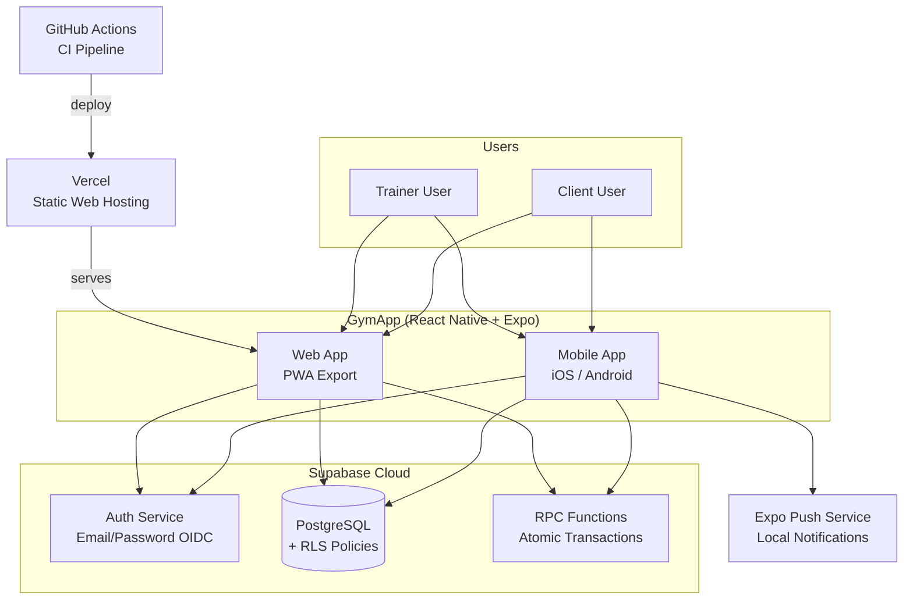
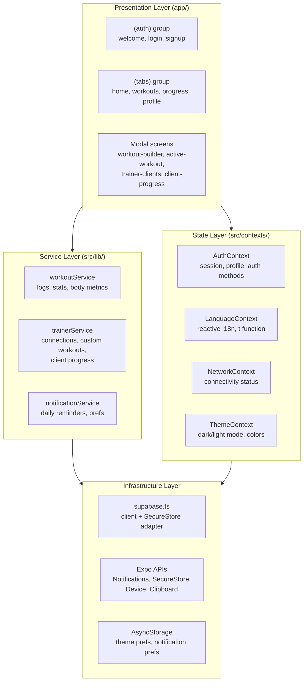
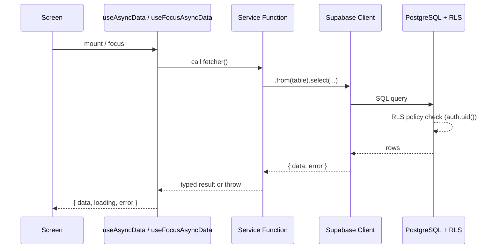
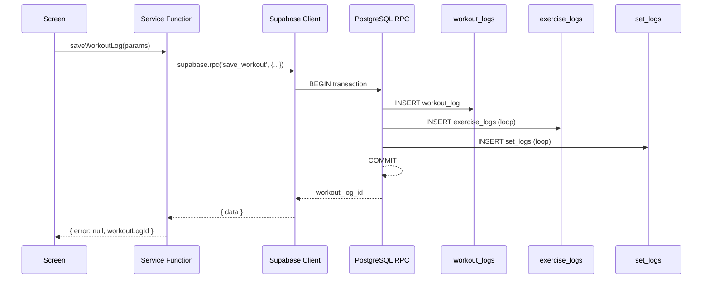

# GymApp Architecture

## Overview

GymApp is a bilingual (Bulgarian/English) mobile fitness application that connects personal trainers with their clients. The app tracks workouts, logs sets/reps/weights, monitors streaks, and provides progress analytics.

**Trainer Model:** Hybrid — trainers can manage individual clients (1-to-1 personal coaching) AND publish programs that any user can follow (1-to-many public content).

## Tech Stack

| Layer | Technology | Version |
|-------|-----------|---------|
| Framework | React Native | 0.81.5 |
| Platform SDK | Expo | SDK 54 |
| Router | expo-router | v6 |
| Language | TypeScript | 5.9 (strict) |
| Backend | Supabase | Auth + PostgreSQL |
| Security | Row Level Security | Enforced on all tables |
| Icons | @expo/vector-icons | Ionicons |
| State | React Context | + local component state |

## System Context



## Component Architecture



## Data Flow

### Read Flow



### Atomic Write Flow (via RPC)



## External Dependencies

| Package | Purpose | Runtime? |
|---------|---------|----------|
| `@supabase/supabase-js` | Auth, database queries, RPC calls | Yes |
| `expo-notifications` | Local daily workout reminders | Yes |
| `expo-secure-store` | Secure token persistence (native) | Yes |
| `expo-device` | Physical device check for notifications | Yes |
| `expo-clipboard` | Copy invite codes | Yes |
| `expo-image` | Optimized image display | Yes |
| `expo-linear-gradient` | UI gradient backgrounds | Yes |
| `@react-native-community/netinfo` | Network connectivity detection | Yes |
| `@react-native-async-storage/async-storage` | Theme + notification preferences | Yes |
| `react-native-gesture-handler` | Navigation gestures | Yes |
| `react-native-reanimated` | Animations and transitions | Yes |
| `react-native-safe-area-context` | Safe area insets | Yes |

## Project Structure

```
GymApp/
├── app/                          # expo-router file-based screens
│   ├── _layout.tsx               # Root layout (AuthProvider + auth guard)
│   ├── index.tsx                 # Entry redirect
│   ├── (auth)/                   # Auth route group (unauthenticated)
│   │   ├── _layout.tsx
│   │   ├── welcome.tsx
│   │   ├── login.tsx
│   │   └── signup.tsx
│   ├── (tabs)/                   # Main tab group (authenticated clients)
│   │   ├── _layout.tsx           # Tab bar configuration
│   │   ├── index.tsx             # Home screen
│   │   ├── workouts.tsx          # Workout list
│   │   ├── progress.tsx          # Progress/analytics
│   │   └── profile.tsx           # User profile
│   ├── workout/[id].tsx          # Workout detail (pre-start)
│   └── active-workout/[id].tsx   # Active workout session
├── src/
│   ├── constants/
│   │   ├── theme.ts              # Design system tokens
│   │   └── i18n.ts               # Translation strings + t() function
│   ├── contexts/
│   │   └── AuthContext.tsx        # Global auth state provider
│   ├── lib/
│   │   ├── supabase.ts           # Supabase client initialization
│   │   └── workoutService.ts     # Data access functions
│   ├── data/
│   │   └── workouts.ts           # Sample workout data
│   └── types/
│       └── index.ts              # Shared TypeScript types
├── supabase/
│   └── schema.sql                # Database schema (source of truth)
├── Documentation/                # App documentation
├── docs/plans/                   # Implementation plans
├── ROADMAP.md                    # Product roadmap
├── app.json                      # Expo configuration
├── package.json                  # Dependencies
└── tsconfig.json                 # TypeScript configuration
```

## Navigation Architecture

GymApp uses **expo-router v6** with file-based routing and layout groups.

### Route Groups

| Group | Purpose | Access |
|-------|---------|--------|
| `(auth)` | Welcome, login, signup | Unauthenticated only |
| `(tabs)` | Main app tab bar | Authenticated only |
| `workout/[id]` | Workout detail modal | Authenticated |
| `active-workout/[id]` | Active session (gesture disabled) | Authenticated |

### Auth Guard

The root `_layout.tsx` implements an auth guard using `useSegments()` and `useRouter()`:

```
User opens app
  → loading? → Show spinner
  → No session + not in (auth)? → Redirect to /(auth)/welcome
  → Has session + in (auth)? → Redirect to /(tabs)
  → Otherwise → Render current route
```

### Tab Bar

4 static tabs using `Ionicons`:

| Tab | Icon | Screen |
|-----|------|--------|
| Home | `home` | Dashboard with stats |
| Workouts | `barbell` | Workout list |
| Progress | `stats-chart` | Analytics + body metrics |
| Profile | `person` | User settings |

### Conditional Navigation

The tab layout conditionally renders based on `profile.role`:
- **Client tabs:** Home, Workouts, Progress, Profile
- **Trainer tabs:** Dashboard, Clients, Programs, Profile

The root layout uses a role-based redirect to direct trainers to the dashboard and clients to the home tab.

## Authentication

### Provider

Supabase Auth with email/password. The `AuthProvider` wraps the entire app and exposes:

```typescript
interface AuthContextType {
  session: Session | null;
  user: User | null;
  profile: Profile | null;
  loading: boolean;
  signUp(email, password, name, role): Promise<{ error }>
  signIn(email, password): Promise<{ error }>
  signOut(): Promise<void>
  refreshProfile(): Promise<void>
}
```

### Profile Interface

```typescript
interface Profile {
  id: string;
  name: string;
  email: string;
  role: 'client' | 'trainer';
  language: 'bg' | 'en';
  weight: number | null;
  height: number | null;
  goal: string | null;
  avatar_url: string | null;
}
```

### Session Persistence

- **Native (iOS/Android):** `expo-secure-store` via `ExpoSecureStoreAdapter`
- **Web:** `localStorage` fallback
- Supabase handles token refresh automatically via `onAuthStateChange`

### Role Selection

Users choose their role (client/trainer) during signup. The role is passed via `options.data` in `supabase.auth.signUp()` and the `handle_new_user()` trigger copies it to the `profiles` table.

## State Management

**Pattern:** React Context + local component state. No external state library (Redux, Zustand, etc.).

- **Global state:** `AuthContext` — session, user profile, auth methods
- **Screen state:** `useState` + `useCallback` for data fetching
- **No caching layer** — data is fetched fresh on each screen mount

### Data Flow

```
Screen mounts
  → useEffect calls service function
  → Service function queries Supabase
  → setState with results
  → UI re-renders
```

## Data Access Layer

All database operations go through service files in `src/lib/`:

### `workoutService.ts`

| Function | Purpose |
|----------|---------|
| `saveWorkoutLog()` | Save completed workout with exercises and sets |
| `getWorkoutHistory()` | Fetch user's completed workouts |
| `getWorkoutStats()` | Calculate streak, weekly count, total |
| `getExerciseHistory()` | Get history for a specific exercise |
| `saveBodyMetric()` | Upsert daily body weight |
| `getBodyMetrics()` | Fetch weight history |

### `supabase.ts`

Initializes the Supabase client with:
- Project URL + anon key from environment variables
- Custom `ExpoSecureStoreAdapter` for token storage
- **Dev proxy fallback:** If env vars are missing, uses a local proxy URL for development without Supabase credentials

### `trainerService.ts`

| Function | Purpose |
|----------|---------|
| `createInviteCode()` | Generate 6-char invite code for client onboarding |
| `getActiveInvites()` | List unused, non-expired invite codes |
| `redeemInviteCode()` | Client redeems code, creates pending connection |
| `getTrainerClients()` | Get trainer's active connected clients |
| `getPendingRequests()` | Get pending (client-confirmed) connection requests |
| `getClientTrainer()` | Get client's current trainer connection |
| `removeConnection()` | Either party removes the connection |
| `confirmConnection()` | Client confirms connection via RPC |
| `approveConnection()` | Trainer approves pending connection via RPC |
| `rejectConnection()` | Trainer rejects pending connection via RPC |
| `getCustomWorkouts()` | List trainer's custom workout templates |
| `getCustomWorkout()` | Get single custom workout by ID |
| `createCustomWorkout()` | Create new custom workout |
| `updateCustomWorkout()` | Update existing custom workout fields |
| `deleteCustomWorkout()` | Delete a custom workout |
| `getClientProfile()` | Get client profile (trainer access via RLS) |
| `getClientWorkoutLogs()` | Get client's workout history (trainer access) |
| `getClientBodyMetrics()` | Get client's body metrics (trainer access) |
| `getClientProgress()` | Full aggregated client progress data |

### `notificationService.ts`

| Function | Purpose |
|----------|---------|
| `requestNotificationPermission()` | Request OS notification permission |
| `getNotificationPreferences()` | Load prefs from AsyncStorage |
| `saveNotificationPreferences()` | Persist prefs to AsyncStorage |
| `scheduleDailyReminder()` | Schedule daily workout reminder |
| `cancelDailyReminder()` | Cancel scheduled reminder |
| `toggleNotifications()` | Enable/disable with permission handling |
| `updateReminderTime()` | Reschedule at new time |
| `addNotificationResponseListener()` | Handle notification taps |

## Design System

Dark theme with consistent design tokens defined in `src/constants/theme.ts`:

### Colors

| Token | Value | Usage |
|-------|-------|-------|
| `primary` | `#4F46E5` | Buttons, accents, active states |
| `primaryLight` | `#6366F1` | Badges, highlights |
| `primaryDark` | `#3730A3` | Pressed states, secondary accent |
| `accent` | `#F59E0B` | Warnings, streaks, attention |
| `background` | `#0F0F1A` | Screen background |
| `surface` | `#1A1A2E` | Card backgrounds |
| `surfaceLight` | `#252542` | Elevated cards, progress bars |
| `text` | `#FFFFFF` | Primary text |
| `textSecondary` | `#9CA3AF` | Labels, descriptions |
| `success` | `#10B981` | Positive states |
| `error` | `#EF4444` | Error states |

### Spacing

```
xs: 4  |  sm: 8  |  md: 16  |  lg: 24  |  xl: 32  |  xxl: 48
```

### Font Sizes

```
xs: 12  |  sm: 14  |  md: 16  |  lg: 18  |  xl: 22  |  xxl: 28  |  xxxl: 34
```

### Border Radius

```
sm: 8  |  md: 12  |  lg: 16  |  xl: 24  |  full: 9999
```

## Internationalization (i18n)

Custom lightweight system (no i18n library).

- **Languages:** Bulgarian (default) + English
- **Implementation:** `t()` function in `src/constants/i18n.ts`
- **Language source:** `profile.language` from database
- **Pattern:** `t('home.greeting')` returns the translated string
- **Fallback:** Bulgarian if key not found in current language

### Known Issues (see GitHub issues #1, #2)

- Language selection is not reactive (requires app restart)
- Some strings are hardcoded in Bulgarian, bypassing the i18n system

## User Roles

### Client

- Default role on signup
- Browses sample workouts, logs completions
- Tracks body metrics and progress
- Can connect to a trainer via invite code (planned)
- Receives workout assignments (planned)

### Trainer

- Selected during signup
- Creates custom workout templates (planned)
- Manages connected clients (planned)
- Assigns workouts, monitors progress (planned)
- Publishes public programs (planned)
- Provides feedback on completed workouts (planned)

## Key Screens

### Home (`(tabs)/index.tsx`)

Greeting, today's workout card, quick stats (streak/weekly/total), weekly goal progress bar.

### Workouts (`(tabs)/workouts.tsx`)

List of available workouts from sample data. Each card shows name, duration, difficulty, exercise count.

### Active Workout (`active-workout/[id].tsx`)

Real-time workout session. Timer, exercise list with sets to complete, weight/reps input per set, completion tracking. Gesture navigation disabled to prevent accidental exits.

### Progress (`(tabs)/progress.tsx`)

Body metrics chart (weight over time), workout history list, exercise-specific history.

### Profile (`(tabs)/profile.tsx`)

User info display, language toggle, logout button. Edit profile is a placeholder (issue #12).

## Planned Architecture (Phase 3: Trainer Core)

### Conditional Route Groups

```
app/
├── (tabs)/              # Client tab bar
├── (trainer-tabs)/      # Trainer tab bar (new)
│   ├── index.tsx        # Trainer Dashboard
│   ├── clients.tsx      # Client list
│   ├── programs.tsx     # Workout programs
│   └── profile.tsx      # Shared profile
└── trainer/             # Trainer detail screens
    ├── client/[id].tsx
    ├── workout-builder.tsx
    ├── assign-workout.tsx
    └── invite.tsx
```

### Role-Based Redirect

The root `_layout.tsx` will redirect based on `profile.role`:
- `role === 'trainer'` → `/(trainer-tabs)`
- `role === 'client'` → `/(tabs)`

### New Service Layer

`src/lib/trainerService.ts` will handle:
- Invite code generation and validation
- Client relationship management
- Workout template CRUD
- Assignment operations
- Feedback and goal management

See `docs/plans/2026-05-13-trainer-core.md` for the full implementation plan.
