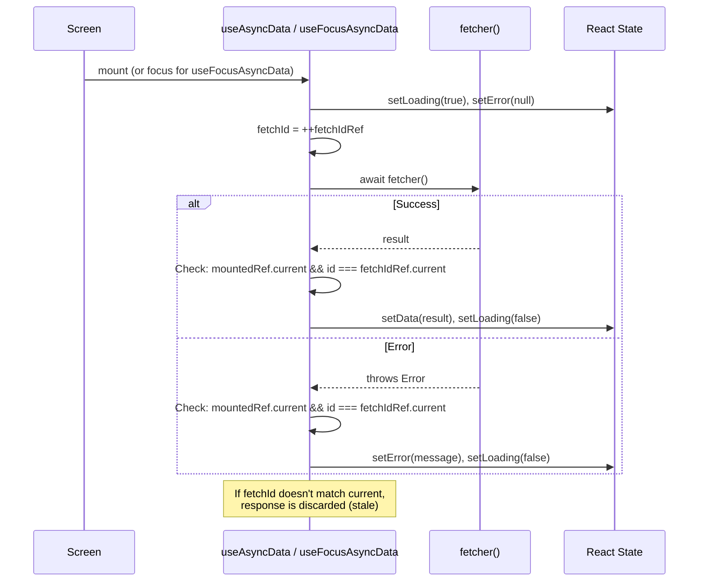
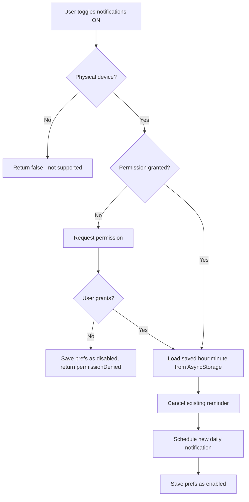

# Async & Event Patterns

## Overview

GymApp handles asynchronous data with custom hooks that manage loading states, error handling, and race condition prevention. There are no real-time subscriptions (Supabase Realtime is not used) — data freshness relies on refetching when screens gain focus.

---

## Data Fetching Hooks

Source: `src/hooks/useAsyncData.ts`

### useAsyncData\<T\>

Generic hook for fetching data on component mount. Handles loading states, errors, and stale closure prevention.

```typescript
function useAsyncData<T>(options: {
  fetcher: () => Promise<T>;  // Async function that returns data
  defaultValue: T;            // Value used while loading
  enabled?: boolean;          // Skip fetch if false (default: true)
}): {
  data: T;
  loading: boolean;
  error: string | null;
  retry: () => void;          // Manual refetch trigger
}
```

**Race condition prevention:**
- Uses `fetchIdRef` (incrementing counter) to discard responses from superseded fetches
- Uses `mountedRef` to prevent state updates after unmount

**When to use:** For data that only needs to load once when the screen mounts (e.g., settings, single-resource views).

---

### useFocusAsyncData\<T\>

Same interface as `useAsyncData` but re-fetches every time the screen gains focus (via React Navigation's `useFocusEffect`).

```typescript
function useFocusAsyncData<T>(options: UseAsyncDataOptions<T>): UseAsyncDataReturn<T>
```

**When to use:** For data that should refresh when the user navigates back (e.g., workout history after completing a workout, client list after approving a connection).

**Key difference:** Wraps `execute()` in `useFocusEffect(useCallback(...))` instead of `useEffect`.

---

### Hook Flow



---

## Notification System

Source: `src/lib/notificationService.ts`

### Architecture

- **Local notifications only** — no server-side push, no Expo Push Token registration
- **Scheduling:** Uses `expo-notifications` with `SchedulableTriggerInputTypes.DAILY`
- **Preferences:** Stored in `AsyncStorage` (not Supabase — notifications are device-local)
- **Platform support:** iOS and Android only (returns `false` on web)

### Notification Configuration

```typescript
Notifications.setNotificationHandler({
  handleNotification: async () => ({
    shouldShowAlert: true,    // Show in-app banner
    shouldPlaySound: true,    // Play notification sound
    shouldSetBadge: false,    // Don't update app badge
    shouldShowBanner: true,   // Show system banner
    shouldShowList: true,     // Show in notification center
  }),
});
```

### Daily Reminder Flow



### Storage Keys

| Key | Type | Default | Purpose |
|-----|------|---------|---------|
| `notifications_enabled` | `'true' \| 'false'` | `'false'` | Master toggle |
| `reminder_hour` | `string (0-23)` | `'9'` | Hour of daily reminder |
| `reminder_minute` | `string (0-59)` | `'0'` | Minute of daily reminder |

### Android Channel

On Android, a notification channel `'workout-reminders'` is created with:
- Name: "Workout Reminders"
- Importance: HIGH
- Vibration pattern: `[0, 250, 250, 250]`
- Light color: `#4F46E5` (primary brand color)

---

## Network Awareness

Source: `src/contexts/NetworkContext.tsx`

### NetworkContext

Monitors device connectivity using `@react-native-community/netinfo`.

```typescript
interface NetworkContextValue {
  isConnected: boolean;            // Network interface available
  isInternetReachable: boolean | null;  // Can reach the internet (null = unknown)
}
```

**Implementation:** Subscribes to `NetInfo.addEventListener` on mount, updates state on every connectivity change.

**Usage:** `const { isConnected } = useNetwork()`

---

### OfflineBanner Component

Source: `src/components/OfflineBanner.tsx`

Displays a persistent banner at the top of the screen when the device is offline. Automatically shown/hidden based on `NetworkContext.isConnected`.

---

### useOfflineGuard Hook

Source: `src/hooks/useOfflineGuard.ts`

Prevents network-dependent actions when offline by showing an alert instead of attempting the operation.

```typescript
function useOfflineGuard(): {
  isConnected: boolean;
  guardAction: (action: () => void | Promise<void>) => void;
}
```

**Behavior:**
- If online: executes the action immediately
- If offline: shows a platform-appropriate alert (native `Alert.alert` or `window.alert` on web) with a translated message

**Usage:**
```typescript
const { guardAction } = useOfflineGuard();

// Wrapping a network-dependent action
guardAction(() => saveWorkoutLog(params));
```

---

## No Real-Time Subscriptions

GymApp does **not** use Supabase Realtime (WebSocket subscriptions). All data is fetched on-demand:

- **On mount:** via `useAsyncData`
- **On focus:** via `useFocusAsyncData`
- **On user action:** explicit refetch after mutations (e.g., refresh client list after approving a connection)

This simplifies the architecture — no subscription management, no connection handling, no conflict resolution. The trade-off is that data is only as fresh as the last screen focus event.

**Potential future use:** If the app adds real-time features (chat, live workout sharing, instant notifications of trainer feedback), Supabase Realtime channels would be the natural addition.
