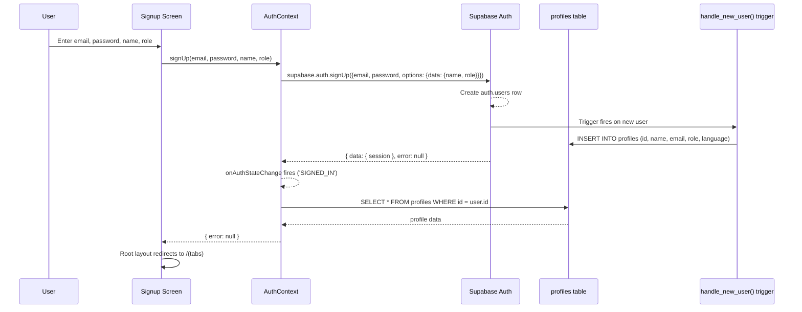
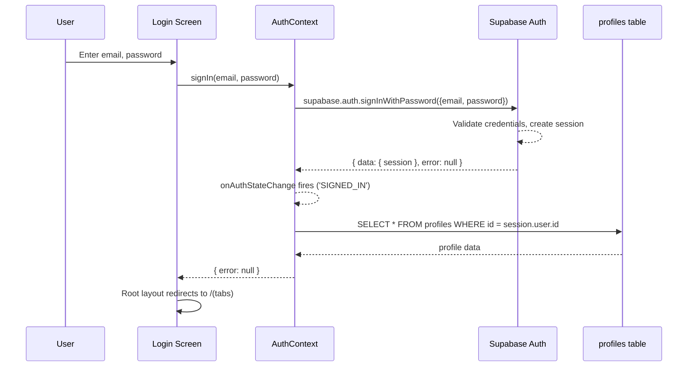
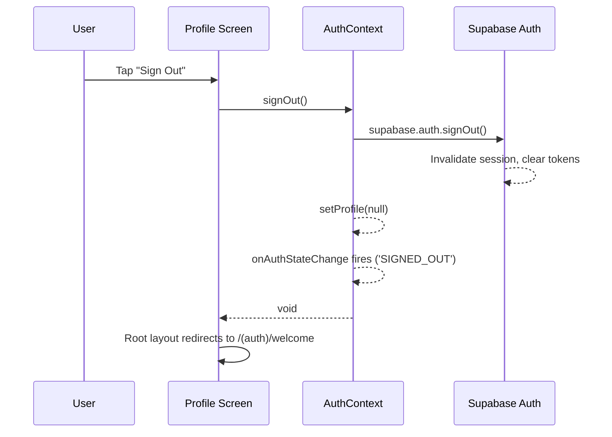
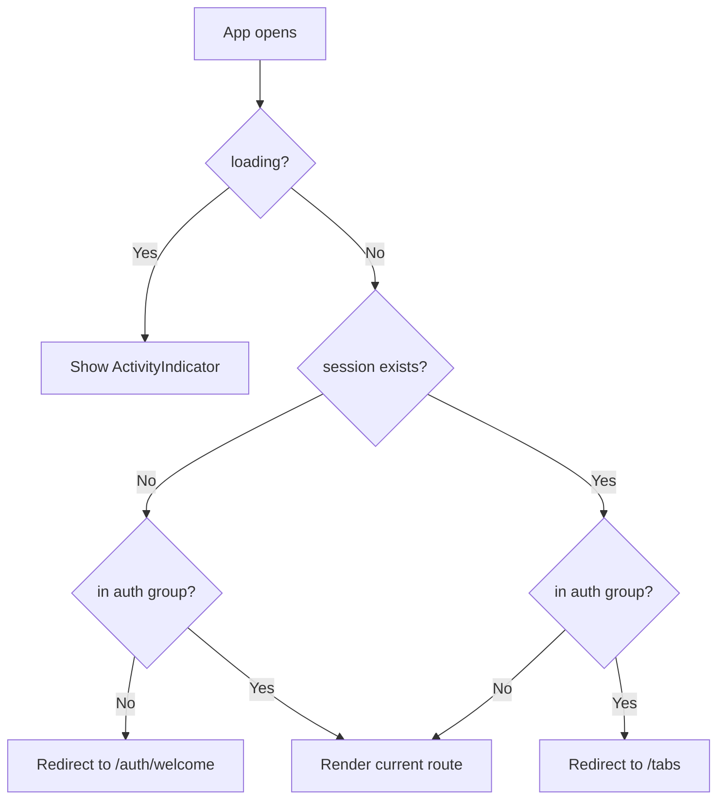
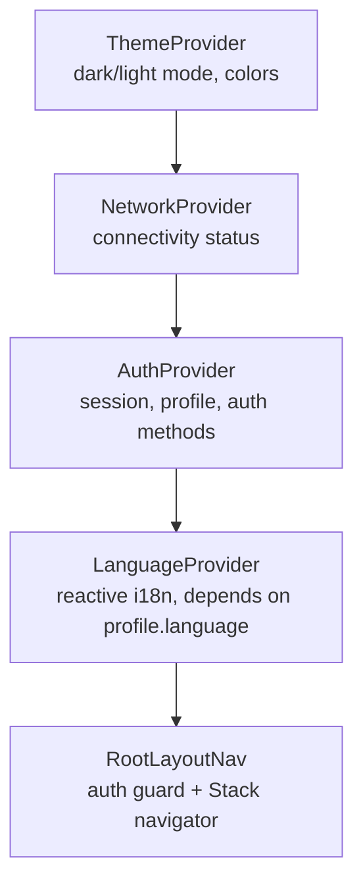

# Authentication Interface

## Overview

GymApp uses **Supabase Auth** with email/password authentication. There are no OAuth providers — users sign up with email, password, name, and role selection.

Authentication state is managed by `AuthContext` (in `src/contexts/AuthContext.tsx`), which wraps the entire application and provides session, profile, and auth methods to all screens.

## AuthContext Interface

```typescript
interface AuthState {
  session: Session | null;        // Supabase session (contains access/refresh tokens)
  user: User | null;              // Supabase auth user (id, email, metadata)
  profile: Profile | null;        // App profile from 'profiles' table
  loading: boolean;               // True during initial session check

  signUp(email: string, password: string, name: string, role: 'client' | 'trainer'): Promise<{ error: string | null }>;
  signIn(email: string, password: string): Promise<{ error: string | null }>;
  signOut(): Promise<void>;
  refreshProfile(): Promise<void>;
}
```

### Profile Shape

```typescript
interface Profile {
  id: string;                     // UUID (matches auth.users.id)
  name: string;                   // Display name
  email: string;                  // Email address
  role: 'client' | 'trainer';    // User role (set during signup, immutable)
  language: 'bg' | 'en';         // UI language preference
  trainer_code: string | null;    // Permanent 6-char invite code (trainers only)
  weight: number | null;          // Body weight (kg)
  height: number | null;          // Height (cm)
  goal: string | null;            // Fitness goal text
  avatar_url: string | null;      // Profile picture URL
}
```

## Authentication Flows

### Sign Up



### Sign In



### Sign Out



### Session Refresh (Automatic)

The Supabase SDK automatically refreshes the access token before expiry using the stored refresh token. This happens transparently via `onAuthStateChange('TOKEN_REFRESHED')`.

- **Native (iOS/Android):** Tokens stored in `expo-secure-store` (encrypted keychain)
- **Web:** Tokens stored in `localStorage`

## Auth Guard Mechanism

The root layout (`app/_layout.tsx`) implements route protection:



Implementation uses `useSegments()` to detect the current route group and `useRouter().replace()` for redirects. This runs in a `useEffect` that watches `[session, loading, segments]`.

## Role-Based Access

### How Role Affects Navigation

The `(tabs)/_layout.tsx` conditionally renders tab bar items based on `profile.role`:
- **Clients** see: Home, Workouts, Progress, Profile
- **Trainers** see: Dashboard (Home), Workouts, Progress, Profile + additional screens accessible from the dashboard (trainer-clients, client-progress, workout-builder)

### How Role Affects RLS Policies

The `role` field in the `profiles` table determines what data a user can access:
- **Clients** can only access their own data (workout_logs, body_metrics, exercise_logs)
- **Trainers** can read their connected clients' data via RLS policies that JOIN to `trainer_clients` where `status = 'active'`
- **Trainer-only operations** (creating invite codes, approving connections) are enforced by RLS policies checking `profiles.role = 'trainer'`

### How Role Is Set

Role is selected during signup and passed via `options.data` metadata. The `handle_new_user()` database trigger copies it to the `profiles` table. For trainers, the trigger also auto-generates a unique 6-character `trainer_code` (permanent invite code). Role is immutable after account creation.

## Provider Hierarchy



The ordering matters:
- `ThemeProvider` is outermost because colors are needed by everything including the loading spinner
- `NetworkProvider` is before Auth so offline detection works during auth flows
- `AuthProvider` must be before `LanguageProvider` because language syncs from `profile.language`
- `LanguageProvider` is innermost because screens use `useTranslation()` for reactive i18n
