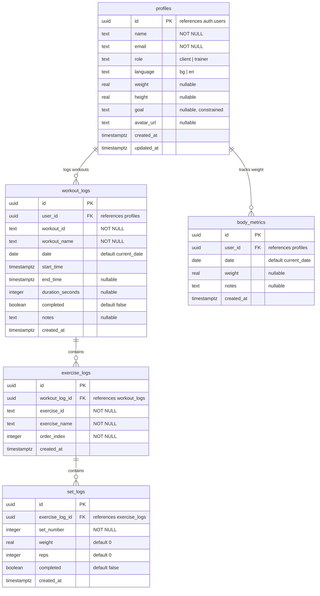
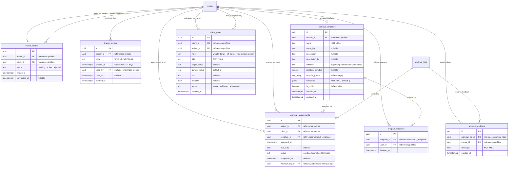

# GymApp Database Schema

## Overview

GymApp uses **Supabase** (hosted PostgreSQL) with **Row Level Security (RLS)** enforced on all tables. The schema lives in `supabase/schema.sql` as the source of truth.

**Current state:** 5 tables supporting workout logging and body metrics.
**Planned:** 7 additional tables for trainer features (see Planned Schema section).

---

## Current Schema

### Entity Relationship Diagram



---

### Table Details

#### `profiles`

Extends Supabase `auth.users`. Created automatically on signup via trigger.

| Column | Type | Constraints |
|--------|------|-------------|
| `id` | uuid | PK, FK → auth.users ON DELETE CASCADE |
| `name` | text | NOT NULL |
| `email` | text | NOT NULL |
| `role` | text | NOT NULL, default `'client'`, CHECK (`client`, `trainer`) |
| `language` | text | NOT NULL, default `'bg'`, CHECK (`bg`, `en`) |
| `weight` | real | nullable |
| `height` | real | nullable |
| `goal` | text | nullable, CHECK (`lose_weight`, `build_muscle`, `get_stronger`, `stay_healthy`, `improve_endurance`) |
| `avatar_url` | text | nullable |
| `created_at` | timestamptz | NOT NULL, default `now()` |
| `updated_at` | timestamptz | NOT NULL, default `now()` |

#### `workout_logs`

Each completed (or in-progress) workout session.

| Column | Type | Constraints |
|--------|------|-------------|
| `id` | uuid | PK, default `gen_random_uuid()` |
| `user_id` | uuid | FK → profiles ON DELETE CASCADE, NOT NULL |
| `workout_id` | text | NOT NULL |
| `workout_name` | text | NOT NULL |
| `date` | date | NOT NULL, default `current_date` |
| `start_time` | timestamptz | NOT NULL, default `now()` |
| `end_time` | timestamptz | nullable |
| `duration_seconds` | integer | nullable |
| `completed` | boolean | NOT NULL, default `false` |
| `notes` | text | nullable |
| `created_at` | timestamptz | NOT NULL, default `now()` |

#### `exercise_logs`

Each exercise performed within a workout session.

| Column | Type | Constraints |
|--------|------|-------------|
| `id` | uuid | PK, default `gen_random_uuid()` |
| `workout_log_id` | uuid | FK → workout_logs ON DELETE CASCADE, NOT NULL |
| `exercise_id` | text | NOT NULL |
| `exercise_name` | text | NOT NULL |
| `order_index` | integer | NOT NULL |
| `created_at` | timestamptz | NOT NULL, default `now()` |

#### `set_logs`

Individual sets within an exercise.

| Column | Type | Constraints |
|--------|------|-------------|
| `id` | uuid | PK, default `gen_random_uuid()` |
| `exercise_log_id` | uuid | FK → exercise_logs ON DELETE CASCADE, NOT NULL |
| `set_number` | integer | NOT NULL |
| `weight` | real | NOT NULL, default `0` |
| `reps` | integer | NOT NULL, default `0` |
| `completed` | boolean | NOT NULL, default `false` |
| `created_at` | timestamptz | NOT NULL, default `now()` |

#### `body_metrics`

Daily body measurements (one entry per user per day).

| Column | Type | Constraints |
|--------|------|-------------|
| `id` | uuid | PK, default `gen_random_uuid()` |
| `user_id` | uuid | FK → profiles ON DELETE CASCADE, NOT NULL |
| `date` | date | NOT NULL, default `current_date` |
| `weight` | real | nullable |
| `notes` | text | nullable |
| `created_at` | timestamptz | NOT NULL, default `now()` |
| | | UNIQUE (`user_id`, `date`) |

---

### Indexes

| Index | Table | Columns |
|-------|-------|---------|
| `idx_workout_logs_user` | workout_logs | `(user_id, date DESC)` |
| `idx_exercise_logs_workout` | exercise_logs | `(workout_log_id)` |
| `idx_set_logs_exercise` | set_logs | `(exercise_log_id)` |
| `idx_body_metrics_user` | body_metrics | `(user_id, date DESC)` |

---

### Row Level Security Policies

All tables have RLS enabled. Users can only access their own data.

#### `profiles`

| Policy | Operation | Rule |
|--------|-----------|------|
| Users can view own profile | SELECT | `auth.uid() = id` |
| Users can update own profile | UPDATE | `auth.uid() = id` |
| Users can insert own profile | INSERT | `auth.uid() = id` |

#### `workout_logs`

| Policy | Operation | Rule |
|--------|-----------|------|
| Users can view own workout logs | SELECT | `auth.uid() = user_id` |
| Users can insert own workout logs | INSERT | `auth.uid() = user_id` |
| Users can update own workout logs | UPDATE | `auth.uid() = user_id` |

#### `exercise_logs`

| Policy | Operation | Rule |
|--------|-----------|------|
| Users can view own exercise logs | SELECT | via JOIN to workout_logs where `user_id = auth.uid()` |
| Users can insert own exercise logs | INSERT | via JOIN to workout_logs where `user_id = auth.uid()` |

#### `set_logs`

| Policy | Operation | Rule |
|--------|-----------|------|
| Users can view own set logs | SELECT | via JOIN through exercise_logs → workout_logs where `user_id = auth.uid()` |
| Users can insert own set logs | INSERT | via JOIN through exercise_logs → workout_logs where `user_id = auth.uid()` |

#### `body_metrics`

| Policy | Operation | Rule |
|--------|-----------|------|
| Users can view own metrics | SELECT | `auth.uid() = user_id` |
| Users can insert own metrics | INSERT | `auth.uid() = user_id` |
| Users can update own metrics | UPDATE | `auth.uid() = user_id` |

---

### Trigger

#### `handle_new_user()`

Automatically creates a `profiles` row when a user signs up via Supabase Auth.

```sql
CREATE TRIGGER on_auth_user_created
  AFTER INSERT ON auth.users
  FOR EACH ROW EXECUTE PROCEDURE public.handle_new_user();
```

The function reads from `raw_user_meta_data`:
- `name` → `profiles.name` (falls back to empty string)
- `role` → `profiles.role` (falls back to `'client'`)
- `email` → from `auth.users.email`

---

## Planned Schema (Phase 3: Trainer Core)

These tables will be added to support trainer features (issues #16-23). See `docs/plans/2026-05-13-trainer-core.md` for the full migration.

### Planned Entity Relationship Diagram



---

### Planned Table Summary

| Table | Purpose | Key Relationships |
|-------|---------|-------------------|
| `trainer_clients` | Trainer-client connections | UNIQUE(trainer_id, client_id) |
| `trainer_invites` | Invite codes for linking | trainer_id, used_by |
| `workout_templates` | Reusable workout blueprints | creator_id, exercises as JSONB |
| `workout_assignments` | Assigned workouts to clients | trainer_id, client_id, template_id |
| `program_followers` | Public program subscriptions | UNIQUE(template_id, user_id) |
| `workout_feedback` | Trainer notes on workouts | workout_log_id, trainer_id |
| `client_goals` | Goals set by trainer for client | client_id, trainer_id |

---

### Planned RLS Strategy

The trainer tables introduce cross-user data access. Key principles:

1. **Trainers read connected clients' data** — workout_logs, exercise_logs, set_logs, body_metrics become readable by the trainer via JOIN to `trainer_clients` where `status = 'active'`
2. **Trainers write to their own resources** — templates, assignments, feedback, goals are scoped to `trainer_id = auth.uid()`
3. **Clients read their own assignments/feedback/goals** — scoped to `client_id = auth.uid()`
4. **Public templates readable by all authenticated users** — `is_public = true`
5. **Invite codes readable by anyone** (to validate), writable only by the trainer who created them

### Cross-Table Access Patterns

```
Trainer reads client workout data:
  workout_logs → WHERE user_id IN (
    SELECT client_id FROM trainer_clients 
    WHERE trainer_id = auth.uid() AND status = 'active'
  )

Trainer writes feedback:
  workout_feedback → INSERT WHERE trainer_id = auth.uid() 
    AND workout_log_id belongs to an active client

Client reads assignments:
  workout_assignments → SELECT WHERE client_id = auth.uid()
```
