# GymApp Database Schema

## Overview

GymApp uses **Supabase** (hosted PostgreSQL) with **Row Level Security (RLS)** enforced on all tables. The schema is managed via timestamped migration files in `supabase/migrations/`.

**Current state:** 12 tables supporting workout logging, body metrics, trainer-client relationships, workout assignments, goals, feedback, and messaging.

---

## Entity Relationship Diagram

```mermaid
erDiagram
    profiles ||--o{ workout_logs : "logs workouts"
    profiles ||--o{ body_metrics : "tracks weight"
    profiles ||--o{ trainer_clients : "trains (as trainer)"
    profiles ||--o{ trainer_clients : "trained by (as client)"
    profiles ||--o{ custom_workouts : "creates"
    profiles ||--o{ workout_assignments : "assigns (as trainer)"
    profiles ||--o{ workout_assignments : "receives (as client)"
    profiles ||--o{ workout_feedback : "gives feedback"
    profiles ||--o{ client_goals : "has goals"
    profiles ||--o{ goal_suggestions : "suggests (as trainer)"
    profiles ||--o{ goal_suggestions : "receives (as client)"
    profiles ||--o{ conversations : "participates (as trainer)"
    profiles ||--o{ conversations : "participates (as client)"
    profiles ||--o{ messages : "sends"
    workout_logs ||--o{ exercise_logs : "contains"
    exercise_logs ||--o{ set_logs : "contains"
    workout_logs ||--o{ workout_feedback : "receives feedback"
    custom_workouts ||--o{ workout_assignments : "assigned via"
    client_goals ||--o{ goal_suggestions : "adjustment target"
    conversations ||--o{ messages : "contains"

    profiles {
        uuid id PK "references auth.users"
        text name "NOT NULL"
        text email "NOT NULL"
        text role "client | trainer"
        text language "bg | en"
        text trainer_code "UNIQUE, nullable (trainers only)"
        real weight "nullable"
        real height "nullable"
        text goal "nullable, constrained"
        text avatar_url "nullable"
        timestamptz created_at
        timestamptz updated_at
    }

    workout_logs {
        uuid id PK
        uuid user_id FK "references profiles"
        text workout_id "NOT NULL"
        text workout_name "NOT NULL"
        date date "default current_date"
        timestamptz start_time
        timestamptz end_time "nullable"
        integer duration_seconds "nullable"
        boolean completed "default false"
        text notes "nullable"
        timestamptz created_at
    }

    exercise_logs {
        uuid id PK
        uuid workout_log_id FK "references workout_logs"
        text exercise_id "NOT NULL"
        text exercise_name "NOT NULL"
        integer order_index "NOT NULL"
        timestamptz created_at
    }

    set_logs {
        uuid id PK
        uuid exercise_log_id FK "references exercise_logs"
        integer set_number "NOT NULL"
        real weight "default 0"
        integer reps "default 0"
        boolean completed "default false"
        timestamptz created_at
    }

    body_metrics {
        uuid id PK
        uuid user_id FK "references profiles"
        date date "default current_date"
        real weight "nullable"
        text notes "nullable"
        timestamptz created_at
    }

    trainer_clients {
        uuid id PK
        uuid trainer_id FK "references profiles"
        uuid client_id FK "references profiles"
        text status "pending | active | rejected | removed"
        boolean client_confirmed "default false"
        timestamptz connected_at "default now()"
    }

    custom_workouts {
        uuid id PK
        uuid creator_id FK "references profiles"
        text name "NOT NULL"
        text name_bg "nullable"
        text description "nullable"
        text description_bg "nullable"
        text difficulty "beginner | intermediate | advanced"
        integer duration_minutes "nullable"
        text_array muscle_groups "default empty"
        jsonb exercises "NOT NULL, default []"
        boolean is_public "default false"
        timestamptz created_at
        timestamptz updated_at
    }

    workout_assignments {
        uuid id PK
        uuid trainer_id FK "references profiles"
        uuid client_id FK "references profiles"
        uuid workout_id FK "references custom_workouts"
        timestamptz assigned_at "default now()"
        date due_date "nullable"
        text status "pending | completed | skipped"
        timestamptz completed_at "nullable"
        text notes "nullable"
    }

    workout_feedback {
        uuid id PK
        uuid workout_log_id FK "references workout_logs"
        uuid trainer_id FK "references profiles"
        text message "NOT NULL, 1-2000 chars"
        timestamptz created_at
    }

    client_goals {
        uuid id PK
        uuid client_id FK "references profiles"
        text goal_type "weight_target | lift_target | frequency | custom"
        text title "NOT NULL"
        numeric target_value "nullable"
        numeric current_value "nullable"
        text unit "nullable"
        text exercise_name "nullable"
        date deadline "nullable"
        text status "active | completed | abandoned"
        timestamptz created_at
        timestamptz updated_at
        timestamptz completed_at "nullable"
    }

    goal_suggestions {
        uuid id PK
        uuid trainer_id FK "references profiles"
        uuid client_id FK "references profiles"
        uuid target_goal_id FK "nullable, references client_goals"
        text suggestion_type "new_goal | adjustment"
        text goal_type "weight_target | lift_target | frequency | custom"
        text title "NOT NULL"
        numeric target_value "nullable"
        text unit "nullable"
        text exercise_name "nullable"
        date deadline "nullable"
        text message "nullable"
        text status "pending | accepted | adjusted | rejected"
        timestamptz client_response_at "nullable"
        timestamptz created_at
    }

    conversations {
        uuid id PK
        uuid trainer_id FK "references profiles"
        uuid client_id FK "references profiles"
        timestamptz last_message_at "default now()"
        timestamptz created_at "default now()"
    }

    messages {
        uuid id PK
        uuid conversation_id FK "references conversations"
        uuid sender_id FK "references profiles"
        text content "NOT NULL, 1-2000 chars"
        timestamptz read_at "nullable"
        timestamptz created_at "default now()"
    }
```



---

## Table Details

### `profiles`

Extends Supabase `auth.users`. Created automatically on signup via trigger.

| Column | Type | Constraints |
|--------|------|-------------|
| `id` | uuid | PK, FK -> auth.users ON DELETE CASCADE |
| `name` | text | NOT NULL |
| `email` | text | NOT NULL |
| `role` | text | NOT NULL, default `'client'`, CHECK (`client`, `trainer`) |
| `language` | text | NOT NULL, default `'bg'`, CHECK (`bg`, `en`) |
| `trainer_code` | text | UNIQUE, nullable. Auto-generated 6-char code for trainers. |
| `weight` | real | nullable |
| `height` | real | nullable |
| `goal` | text | nullable, CHECK (`lose_weight`, `build_muscle`, `get_stronger`, `stay_healthy`, `improve_endurance`) |
| `avatar_url` | text | nullable |
| `created_at` | timestamptz | NOT NULL, default `now()` |
| `updated_at` | timestamptz | NOT NULL, default `now()` |

### `workout_logs`

Each completed (or in-progress) workout session.

| Column | Type | Constraints |
|--------|------|-------------|
| `id` | uuid | PK, default `gen_random_uuid()` |
| `user_id` | uuid | FK -> profiles ON DELETE CASCADE, NOT NULL |
| `workout_id` | text | NOT NULL |
| `workout_name` | text | NOT NULL |
| `date` | date | NOT NULL, default `current_date` |
| `start_time` | timestamptz | NOT NULL, default `now()` |
| `end_time` | timestamptz | nullable |
| `duration_seconds` | integer | nullable |
| `completed` | boolean | NOT NULL, default `false` |
| `notes` | text | nullable |
| `created_at` | timestamptz | NOT NULL, default `now()` |

### `exercise_logs`

Each exercise performed within a workout session.

| Column | Type | Constraints |
|--------|------|-------------|
| `id` | uuid | PK, default `gen_random_uuid()` |
| `workout_log_id` | uuid | FK -> workout_logs ON DELETE CASCADE, NOT NULL |
| `exercise_id` | text | NOT NULL |
| `exercise_name` | text | NOT NULL |
| `order_index` | integer | NOT NULL |
| `created_at` | timestamptz | NOT NULL, default `now()` |

### `set_logs`

Individual sets within an exercise.

| Column | Type | Constraints |
|--------|------|-------------|
| `id` | uuid | PK, default `gen_random_uuid()` |
| `exercise_log_id` | uuid | FK -> exercise_logs ON DELETE CASCADE, NOT NULL |
| `set_number` | integer | NOT NULL |
| `weight` | real | NOT NULL, default `0` |
| `reps` | integer | NOT NULL, default `0` |
| `completed` | boolean | NOT NULL, default `false` |
| `created_at` | timestamptz | NOT NULL, default `now()` |

### `body_metrics`

Daily body measurements (one entry per user per day).

| Column | Type | Constraints |
|--------|------|-------------|
| `id` | uuid | PK, default `gen_random_uuid()` |
| `user_id` | uuid | FK -> profiles ON DELETE CASCADE, NOT NULL |
| `date` | date | NOT NULL, default `current_date` |
| `weight` | real | nullable |
| `notes` | text | nullable |
| `created_at` | timestamptz | NOT NULL, default `now()` |
| | | UNIQUE (`user_id`, `date`) |

### `trainer_clients`

Tracks trainer-client relationships with approval workflow.

| Column | Type | Constraints |
|--------|------|-------------|
| `id` | uuid | PK, default `gen_random_uuid()` |
| `trainer_id` | uuid | FK -> profiles ON DELETE CASCADE, NOT NULL |
| `client_id` | uuid | FK -> profiles ON DELETE CASCADE, NOT NULL |
| `status` | text | NOT NULL, default `'pending'`, CHECK (`pending`, `active`, `rejected`, `removed`) |
| `client_confirmed` | boolean | NOT NULL, default `false` |
| `connected_at` | timestamptz | NOT NULL, default `now()` |
| | | UNIQUE (`trainer_id`, `client_id`) |

### `custom_workouts`

Reusable workout templates created by trainers or clients.

| Column | Type | Constraints |
|--------|------|-------------|
| `id` | uuid | PK, default `gen_random_uuid()` |
| `creator_id` | uuid | FK -> profiles ON DELETE CASCADE, NOT NULL |
| `name` | text | NOT NULL |
| `name_bg` | text | nullable (Bulgarian translation) |
| `description` | text | nullable |
| `description_bg` | text | nullable (Bulgarian translation) |
| `difficulty` | text | NOT NULL, CHECK (`beginner`, `intermediate`, `advanced`) |
| `duration_minutes` | integer | nullable |
| `muscle_groups` | text[] | NOT NULL, default `'{}'` |
| `exercises` | jsonb | NOT NULL, default `'[]'` |
| `is_public` | boolean | NOT NULL, default `false` |
| `created_at` | timestamptz | NOT NULL, default `now()` |
| `updated_at` | timestamptz | NOT NULL, default `now()` |

### `workout_assignments`

Trainer assigns custom workouts to connected clients.

| Column | Type | Constraints |
|--------|------|-------------|
| `id` | uuid | PK, default `gen_random_uuid()` |
| `trainer_id` | uuid | FK -> profiles ON DELETE CASCADE, NOT NULL |
| `client_id` | uuid | FK -> profiles ON DELETE CASCADE, NOT NULL |
| `workout_id` | uuid | FK -> custom_workouts ON DELETE CASCADE, NOT NULL |
| `assigned_at` | timestamptz | NOT NULL, default `now()` |
| `due_date` | date | nullable |
| `status` | text | NOT NULL, default `'pending'`, CHECK (`pending`, `completed`, `skipped`) |
| `completed_at` | timestamptz | nullable |
| `notes` | text | nullable |
| | | UNIQUE (`client_id`, `workout_id`, `status`) |

### `workout_feedback`

Trainer comments on a client's completed workout logs.

| Column | Type | Constraints |
|--------|------|-------------|
| `id` | uuid | PK, default `gen_random_uuid()` |
| `workout_log_id` | uuid | FK -> workout_logs ON DELETE CASCADE, NOT NULL |
| `trainer_id` | uuid | FK -> profiles ON DELETE CASCADE, NOT NULL |
| `message` | text | NOT NULL, CHECK (1-2000 chars) |
| `created_at` | timestamptz | NOT NULL, default `now()` |

### `client_goals`

Client-owned goals with measurable targets.

| Column | Type | Constraints |
|--------|------|-------------|
| `id` | uuid | PK, default `gen_random_uuid()` |
| `client_id` | uuid | FK -> profiles ON DELETE CASCADE, NOT NULL |
| `goal_type` | text | NOT NULL, CHECK (`weight_target`, `lift_target`, `frequency`, `custom`) |
| `title` | text | NOT NULL |
| `target_value` | numeric | nullable |
| `current_value` | numeric | nullable |
| `unit` | text | nullable |
| `exercise_name` | text | nullable |
| `deadline` | date | nullable |
| `status` | text | NOT NULL, default `'active'`, CHECK (`active`, `completed`, `abandoned`) |
| `created_at` | timestamptz | NOT NULL, default `now()` |
| `updated_at` | timestamptz | NOT NULL, default `now()` |
| `completed_at` | timestamptz | nullable |

### `goal_suggestions`

Trainer suggestions for new goals or adjustments to existing client goals.

| Column | Type | Constraints |
|--------|------|-------------|
| `id` | uuid | PK, default `gen_random_uuid()` |
| `trainer_id` | uuid | FK -> profiles ON DELETE CASCADE, NOT NULL |
| `client_id` | uuid | FK -> profiles ON DELETE CASCADE, NOT NULL |
| `target_goal_id` | uuid | FK -> client_goals ON DELETE SET NULL, nullable |
| `suggestion_type` | text | NOT NULL, CHECK (`new_goal`, `adjustment`) |
| `goal_type` | text | NOT NULL, CHECK (`weight_target`, `lift_target`, `frequency`, `custom`) |
| `title` | text | NOT NULL |
| `target_value` | numeric | nullable |
| `unit` | text | nullable |
| `exercise_name` | text | nullable |
| `deadline` | date | nullable |
| `message` | text | nullable |
| `status` | text | NOT NULL, default `'pending'`, CHECK (`pending`, `accepted`, `adjusted`, `rejected`) |
| `client_response_at` | timestamptz | nullable |
| `created_at` | timestamptz | NOT NULL, default `now()` |

### `conversations`

One conversation per trainer-client pair for in-app messaging.

| Column | Type | Constraints |
|--------|------|-------------|
| `id` | uuid | PK, default `gen_random_uuid()` |
| `trainer_id` | uuid | FK -> profiles ON DELETE CASCADE, NOT NULL |
| `client_id` | uuid | FK -> profiles ON DELETE CASCADE, NOT NULL |
| `last_message_at` | timestamptz | NOT NULL, default `now()` |
| `created_at` | timestamptz | NOT NULL, default `now()` |
| | | UNIQUE (`trainer_id`, `client_id`) |

### `messages`

Individual messages within a conversation. Realtime-enabled via Supabase Realtime.

| Column | Type | Constraints |
|--------|------|-------------|
| `id` | uuid | PK, default `gen_random_uuid()` |
| `conversation_id` | uuid | FK -> conversations ON DELETE CASCADE, NOT NULL |
| `sender_id` | uuid | FK -> profiles ON DELETE CASCADE, NOT NULL |
| `content` | text | NOT NULL, CHECK (1-2000 chars) |
| `read_at` | timestamptz | nullable (null = unread) |
| `created_at` | timestamptz | NOT NULL, default `now()` |

---

## Deprecated Tables

### `trainer_invites`

> **Deprecated.** Permanent trainer codes (stored in `profiles.trainer_code`) have replaced one-time invite codes. The table still exists but is no longer used by the application. The `redeem_invite_code()` RPC function now looks up `profiles.trainer_code` instead of querying this table.

---

## Indexes

| Index | Table | Columns |
|-------|-------|---------|
| `idx_workout_logs_user` | workout_logs | `(user_id, date DESC)` |
| `idx_exercise_logs_workout` | exercise_logs | `(workout_log_id)` |
| `idx_set_logs_exercise` | set_logs | `(exercise_log_id)` |
| `idx_body_metrics_user` | body_metrics | `(user_id, date DESC)` |
| `idx_workout_feedback_log` | workout_feedback | `(workout_log_id, created_at)` |
| `idx_workout_feedback_trainer` | workout_feedback | `(trainer_id)` |
| `idx_client_goals_client_status` | client_goals | `(client_id, status)` |
| `idx_goal_suggestions_client_status` | goal_suggestions | `(client_id, status)` |
| `idx_goal_suggestions_trainer` | goal_suggestions | `(trainer_id)` |
| `idx_messages_conversation_created` | messages | `(conversation_id, created_at DESC)` |
| `idx_conversations_trainer` | conversations | `(trainer_id)` |
| `idx_conversations_client` | conversations | `(client_id)` |
| `idx_messages_unread` | messages | `(conversation_id, sender_id, read_at) WHERE read_at IS NULL` |

---

## Row Level Security Policies

All tables have RLS enabled. Core data is owned by the user; trainer features introduce cross-user access via JOIN to `trainer_clients`.

### `profiles`

| Policy | Operation | Rule |
|--------|-----------|------|
| Users can view own profile | SELECT | `auth.uid() = id` |
| Users can update own profile | UPDATE | `auth.uid() = id` |
| Users can insert own profile | INSERT | `auth.uid() = id` |
| Trainers can view client profiles | SELECT | Active/pending connection in `trainer_clients` |
| Clients can view trainer profiles | SELECT | Active/pending/rejected connection in `trainer_clients` |

### `workout_logs`

| Policy | Operation | Rule |
|--------|-----------|------|
| Users can view own workout logs | SELECT | `auth.uid() = user_id` |
| Users can insert own workout logs | INSERT | `auth.uid() = user_id` |
| Users can update own workout logs | UPDATE | `auth.uid() = user_id` |
| Trainers can view client workout logs | SELECT | Active connection in `trainer_clients` |

### `exercise_logs`

| Policy | Operation | Rule |
|--------|-----------|------|
| Users can view own exercise logs | SELECT | via JOIN to workout_logs where `user_id = auth.uid()` |
| Users can insert own exercise logs | INSERT | via JOIN to workout_logs where `user_id = auth.uid()` |
| Trainers can view client exercise logs | SELECT | via JOIN to workout_logs + `trainer_clients` |

### `set_logs`

| Policy | Operation | Rule |
|--------|-----------|------|
| Users can view own set logs | SELECT | via JOIN through exercise_logs -> workout_logs |
| Users can insert own set logs | INSERT | via JOIN through exercise_logs -> workout_logs |
| Trainers can view client set logs | SELECT | via JOIN through exercise_logs -> workout_logs + `trainer_clients` |

### `body_metrics`

| Policy | Operation | Rule |
|--------|-----------|------|
| Users can view own metrics | SELECT | `auth.uid() = user_id` |
| Users can insert own metrics | INSERT | `auth.uid() = user_id` |
| Users can update own metrics | UPDATE | `auth.uid() = user_id` |
| Trainers can view client body metrics | SELECT | Active connection in `trainer_clients` |

### `custom_workouts`

| Policy | Operation | Rule |
|--------|-----------|------|
| Clients can read assigned workouts | SELECT | Has a pending assignment, or is creator, or workout is public |

### `workout_assignments`

| Policy | Operation | Rule |
|--------|-----------|------|
| Trainers can insert assignments | INSERT | `trainer_id = auth.uid()` AND active connection to client |
| Trainers can view own assignments | SELECT | `trainer_id = auth.uid()` |
| Trainers can delete own assignments | DELETE | `trainer_id = auth.uid()` |
| Clients can view own assignments | SELECT | `client_id = auth.uid()` |
| Clients can update own assignment status | UPDATE | `client_id = auth.uid()` |

### `workout_feedback`

| Policy | Operation | Rule |
|--------|-----------|------|
| Trainers can insert feedback on client workouts | INSERT | `trainer_id = auth.uid()` AND workout belongs to active client |
| Trainers can read own feedback | SELECT | `trainer_id = auth.uid()` |
| Clients can read feedback on own workouts | SELECT | Workout `user_id = auth.uid()` |

### `client_goals`

| Policy | Operation | Rule |
|--------|-----------|------|
| Clients can read own goals | SELECT | `client_id = auth.uid()` |
| Clients can insert own goals | INSERT | `client_id = auth.uid()` |
| Clients can update own goals | UPDATE | `client_id = auth.uid()` |
| Clients can delete own goals | DELETE | `client_id = auth.uid()` |
| Trainers can read connected client goals | SELECT | Active connection in `trainer_clients` |

### `goal_suggestions`

| Policy | Operation | Rule |
|--------|-----------|------|
| Trainers can insert suggestions | INSERT | `trainer_id = auth.uid()` AND active connection to client |
| Trainers can read own suggestions | SELECT | `trainer_id = auth.uid()` |
| Clients can read own suggestions | SELECT | `client_id = auth.uid()` |
| Clients can update own suggestions | UPDATE | `client_id = auth.uid()` |
| Trainers can delete own pending suggestions | DELETE | `trainer_id = auth.uid()` AND `status = 'pending'` |

### `conversations`

| Policy | Operation | Rule |
|--------|-----------|------|
| Users can view own conversations | SELECT | `auth.uid() = trainer_id OR auth.uid() = client_id` |
| Participants can create conversations | INSERT | Caller is a participant AND active connection exists |
| Participants can update conversations | UPDATE | `auth.uid() = trainer_id OR auth.uid() = client_id` |

### `messages`

| Policy | Operation | Rule |
|--------|-----------|------|
| Participants can view messages | SELECT | Caller is a participant in the conversation |
| Participants can send messages | INSERT | `sender_id = auth.uid()` AND caller is a participant |

---

## Triggers

### `handle_new_user()`

Automatically creates a `profiles` row when a user signs up via Supabase Auth.

```sql
CREATE TRIGGER on_auth_user_created
  AFTER INSERT ON auth.users
  FOR EACH ROW EXECUTE PROCEDURE public.handle_new_user();
```

The function reads from `raw_user_meta_data`:
- `name` -> `profiles.name` (falls back to empty string)
- `role` -> `profiles.role` (falls back to `'client'`)
- `email` -> from `auth.users.email`

**Trainer-specific behavior:** If `role = 'trainer'`, the trigger also generates a unique 6-character `trainer_code` using `generate_trainer_code()`. The code uses the character set `ABCDEFGHJKLMNPQRSTUVWXYZ23456789` (no ambiguous characters I/O/0/1). Collisions are retried automatically.

---

## Realtime

The `messages` table is added to the Supabase Realtime publication, enabling real-time message delivery via WebSocket subscriptions:

```sql
ALTER PUBLICATION supabase_realtime ADD TABLE public.messages;
```

---

## Migration Files

All migrations use 14-digit timestamp format (`YYYYMMDDHHMMSS`):

| File | Purpose |
|------|---------|
| `20260401120000_save_workout_rpc.sql` | `save_workout` RPC function |
| `20260402120000_connection_approval_flow.sql` | `trainer_clients` status workflow, `confirm/approve/reject_connection` RPCs |
| `20260403120000_trainer_read_client_data.sql` | RLS policies for trainer cross-user reads |
| `20260404120000_fix_profile_visibility_rls.sql` | Profile visibility for trainer/client names |
| `20260405120000_permanent_trainer_code.sql` | `trainer_code` column, `generate_trainer_code()`, updated `handle_new_user()` and `redeem_invite_code()` |
| `20260406120000_workout_assignments.sql` | `workout_assignments` table + RLS |
| `20260407120000_client_goals.sql` | `client_goals` + `goal_suggestions` tables + RLS |
| `20260408120000_workout_feedback.sql` | `workout_feedback` table + RLS |
| `20260409120000_remove_trainer_email_from_rpc.sql` | Remove `trainer_email` from `redeem_invite_code` response |
| `20260410120000_messaging.sql` | `conversations` + `messages` tables, messaging RPCs, Realtime |
| `20260411120000_recent_client_activity_rpc.sql` | `get_recent_client_activity` RPC for trainer dashboard |
