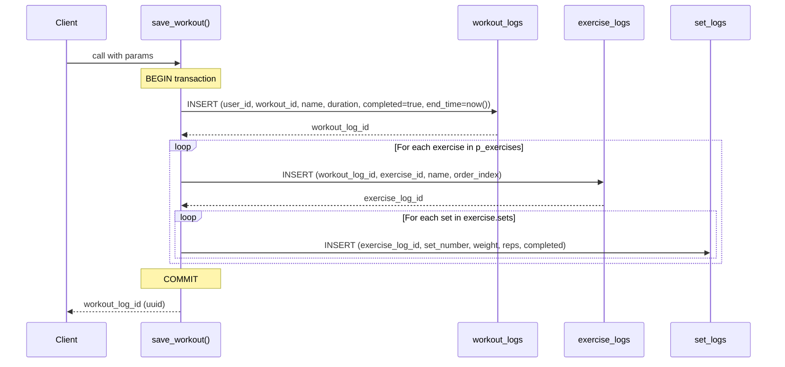
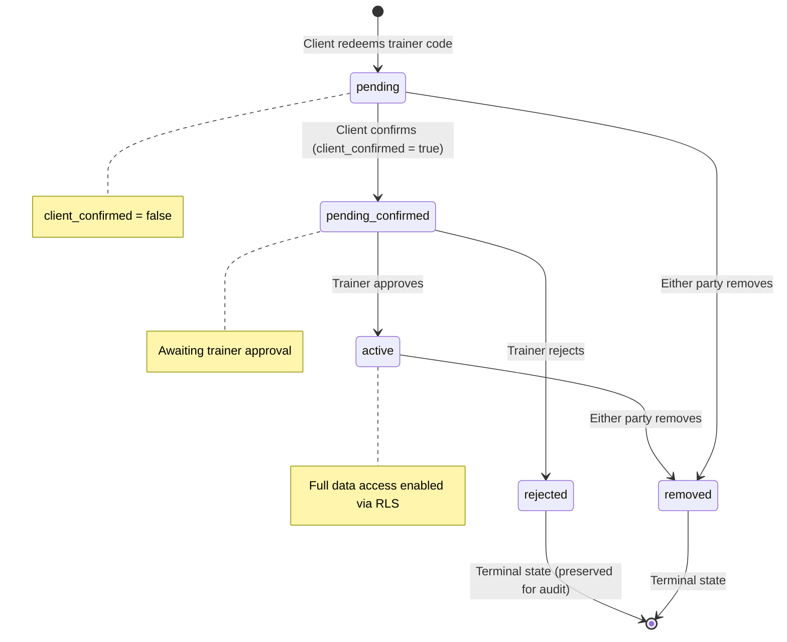

# Supabase RPC Function Reference

## Overview

GymApp uses PostgreSQL RPC functions for operations that require:
- **Atomicity** — multi-table inserts that must succeed or fail together
- **Server-side authorization** — validation that cannot be trusted to the client
- **Complex state transitions** — multi-step operations with conditional logic

All functions use `SECURITY DEFINER` (execute with the function creator's privileges) and validate the caller internally via `auth.uid()`.

Called from the client: `supabase.rpc('function_name', { parameters })`

---

## save_workout

Atomically saves a completed workout session, inserting records into 3 tables in a single transaction.

**Migration:** `supabase/migrations/20260401120000_save_workout_rpc.sql`

### Parameters

| Parameter | Type | Required | Description |
|-----------|------|----------|-------------|
| `p_user_id` | uuid | Yes | The user completing the workout |
| `p_workout_id` | text | Yes | Template workout identifier |
| `p_workout_name` | text | Yes | Display name of the workout |
| `p_duration_seconds` | integer | Yes | Total session duration |
| `p_notes` | text | No | Optional session notes |
| `p_exercises` | jsonb | Yes | Array of exercises with nested sets |

### Exercise JSONB Structure

```json
[
  {
    "exerciseId": "bench-press",
    "exerciseName": "Bench Press",
    "orderIndex": 0,
    "sets": [
      { "setNumber": 1, "weight": 80, "reps": 10, "completed": true },
      { "setNumber": 2, "weight": 85, "reps": 8, "completed": true }
    ]
  }
]
```

### Returns

`uuid` — the ID of the created `workout_logs` row

### Transaction Flow



### Error Behavior

If any INSERT fails (constraint violation, type error), the entire transaction rolls back. No partial data is persisted.

---

## redeem_invite_code

Validates a trainer's permanent code, creates a pending trainer-client connection, and returns trainer info for the confirmation screen.

**Migration:** `supabase/migrations/20260405120000_permanent_trainer_code.sql` (rewritten), `supabase/migrations/20260409120000_remove_trainer_email_from_rpc.sql` (final version)

> **Note:** This function was originally written against the `trainer_invites` table (one-time codes). It now looks up `profiles.trainer_code` instead. The trainer_invites table is deprecated.

### Parameters

| Parameter | Type | Required | Description |
|-----------|------|----------|-------------|
| `p_code` | text | Yes | 6-character trainer code (case-insensitive, uppercased internally) |

### Returns

`jsonb` with one of these shapes:

**Success:**
```json
{
  "success": true,
  "trainer_id": "uuid",
  "trainer_name": "Alex",
  "connection_id": "uuid"
}
```

**Failure:**
```json
{
  "success": false,
  "error": "only_clients | invalid_code | already_connected"
}
```

> **Note:** The response no longer includes `trainer_email` (removed in migration `20260409120000` for privacy).

### Authorization

- Caller must be authenticated (`auth.uid()` is not null)
- Caller must have `role = 'client'` in the `profiles` table
- Caller must not already have an active or pending connection with this trainer

### Behavior

1. Validates caller is a client (rejects trainers with `'only_clients'`)
2. Looks up the code in `profiles` where `trainer_code = upper(p_code)` and `role = 'trainer'`
3. Checks for existing connection (rejects with `'already_connected'`)
4. Creates a `trainer_clients` row with `status = 'pending'`, `client_confirmed = false`
5. Returns trainer name and connection ID for the client confirmation screen

---

## confirm_connection

Client confirms they want to connect with the trainer after redeeming an invite code.

**Migration:** `supabase/migrations/20260402120000_connection_approval_flow.sql`

### Parameters

| Parameter | Type | Required | Description |
|-----------|------|----------|-------------|
| `p_connection_id` | uuid | Yes | The trainer_clients row ID |

### Returns

```json
{ "success": true }
// or
{ "success": false, "error": "not_found" }
```

### Authorization

Only the `client_id` matching `auth.uid()` can confirm. The connection must be in `'pending'` status.

### Behavior

Sets `client_confirmed = true` on the connection row.

---

## approve_connection

Trainer approves a pending connection that the client has already confirmed.

**Migration:** `supabase/migrations/20260402120000_connection_approval_flow.sql`

### Parameters

| Parameter | Type | Required | Description |
|-----------|------|----------|-------------|
| `p_connection_id` | uuid | Yes | The trainer_clients row ID |

### Returns

```json
{ "success": true }
// or
{ "success": false, "error": "not_found" }
```

### Authorization

Only the `trainer_id` matching `auth.uid()` can approve. The connection must be `status = 'pending'` AND `client_confirmed = true`.

### Behavior

Sets `status = 'active'`. After this, RLS policies allow the trainer to read the client's workout and body metric data.

---

## reject_connection

Trainer rejects a pending connection request.

**Migration:** `supabase/migrations/20260402120000_connection_approval_flow.sql`

### Parameters

| Parameter | Type | Required | Description |
|-----------|------|----------|-------------|
| `p_connection_id` | uuid | Yes | The trainer_clients row ID |

### Returns

```json
{ "success": true }
// or
{ "success": false, "error": "not_found" }
```

### Authorization

Only the `trainer_id` matching `auth.uid()` can reject. The connection must be in `'pending'` status.

### Behavior

Sets `status = 'rejected'`. The connection row remains for audit purposes.

---

## send_message

Atomically inserts a new message and updates the conversation's `last_message_at` timestamp.

**Migration:** `supabase/migrations/20260410120000_messaging.sql`

### Parameters

| Parameter | Type | Required | Description |
|-----------|------|----------|-------------|
| `p_conversation_id` | uuid | Yes | The conversation to send the message in |
| `p_content` | text | Yes | Message content (1-2000 characters) |

### Returns

`json` with one of these shapes:

**Success:**
```json
{
  "success": true,
  "message_id": "uuid"
}
```

**Failure:**
```json
{
  "success": false,
  "error": "conversation_not_found | empty_message | message_too_long"
}
```

### Authorization

- Caller must be authenticated (`auth.uid()`)
- Caller must be a participant in the conversation (`trainer_id` or `client_id`)

### Behavior

1. Validates the conversation exists and the caller is a participant
2. Validates content is non-empty and within 2000 characters
3. Inserts the message with `sender_id = auth.uid()`
4. Updates `conversations.last_message_at = now()`
5. Returns the new message ID

---

## mark_messages_read

Marks all unread messages (sent by the other party) in a conversation as read.

**Migration:** `supabase/migrations/20260410120000_messaging.sql`

### Parameters

| Parameter | Type | Required | Description |
|-----------|------|----------|-------------|
| `p_conversation_id` | uuid | Yes | The conversation to mark as read |

### Returns

`void` — no return value

### Authorization

Uses `auth.uid()` internally. Only marks messages where `sender_id != auth.uid()` (messages sent TO the caller).

### Behavior

Sets `read_at = now()` on all messages in the conversation where:
- `sender_id != auth.uid()` (messages from the other party)
- `read_at IS NULL` (not already read)

---

## get_conversations

Returns all conversations for the current user with last message preview and unread count.

**Migration:** `supabase/migrations/20260410120000_messaging.sql`

### Parameters

None — uses `auth.uid()` internally.

### Returns

`json` array of conversation objects:

```json
[
  {
    "id": "uuid",
    "trainer_id": "uuid",
    "client_id": "uuid",
    "last_message_at": "2026-04-10T12:00:00Z",
    "created_at": "2026-04-10T12:00:00Z",
    "trainer_name": "Alex",
    "trainer_email": "alex@example.com",
    "client_name": "Maria",
    "client_email": "maria@example.com",
    "last_message_content": "Great workout today!",
    "unread_count": 2
  }
]
```

### Behavior

1. Finds all conversations where the caller is `trainer_id` or `client_id`
2. Joins trainer and client profiles for names/emails
3. Gets the latest message content via lateral join
4. Counts unread messages (sent by the other party, `read_at IS NULL`)
5. Orders by `last_message_at DESC`

---

## get_or_create_conversation

Finds an existing conversation between two users, or creates a new one. Handles concurrent requests safely via `ON CONFLICT DO NOTHING`.

**Migration:** `supabase/migrations/20260410120000_messaging.sql`

### Parameters

| Parameter | Type | Required | Description |
|-----------|------|----------|-------------|
| `p_other_user_id` | uuid | Yes | The other user to start/find a conversation with |

### Returns

`json` with one of these shapes:

**Success:**
```json
{
  "success": true,
  "conversation_id": "uuid"
}
```

**Failure:**
```json
{
  "success": false,
  "error": "user_not_found | invalid_roles | no_active_connection"
}
```

### Authorization

- Caller must be authenticated
- One party must be a trainer and the other a client (no client-client or trainer-trainer messaging)
- An active connection must exist in `trainer_clients`

### Behavior

1. Determines which user is the trainer and which is the client based on `profiles.role`
2. Validates an active trainer-client connection exists
3. Inserts a new conversation (or no-ops if one already exists via `ON CONFLICT`)
4. Returns the conversation ID

---

## Connection Lifecycle



### State Transition Summary

| From | To | Who | How |
|------|-----|-----|-----|
| — | `pending` | System | `redeem_invite_code()` creates row |
| `pending` | `pending` (confirmed) | Client | `confirm_connection()` sets `client_confirmed = true` |
| `pending` (confirmed) | `active` | Trainer | `approve_connection()` |
| `pending` (confirmed) | `rejected` | Trainer | `reject_connection()` |
| `active` / `pending` | `removed` | Either | `removeConnection()` (service layer, not RPC) |
