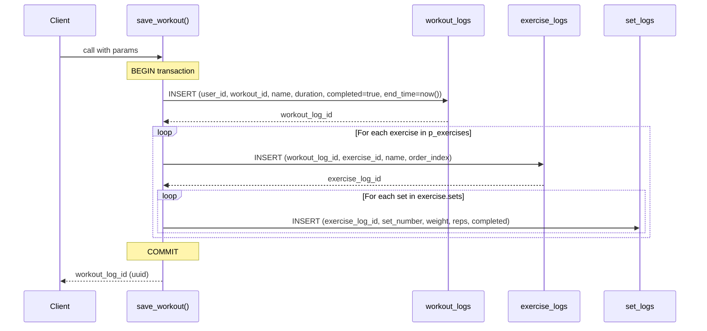

# Supabase RPC Function Reference

## Overview

GymApp uses PostgreSQL RPC functions for operations that require:
- **Atomicity** — multi-table inserts that must succeed or fail together
- **Server-side authorization** — validation that cannot be trusted to the client
- **Complex state transitions** — multi-step operations with conditional logic

All functions use `SECURITY DEFINER` (execute with the function creator's privileges) and validate the caller internally via `auth.uid()`, except `get_recent_client_activity` which uses `SECURITY INVOKER` (relies on the caller's RLS policies).

Called from the client: `supabase.rpc('function_name', { parameters })`

---

## save_workout

Atomically saves a completed workout session, inserting records into 3 tables in a single transaction.

**Migration:** `supabase/migrations/001_save_workout_rpc.sql`

### Parameters

| Parameter | Type | Required | Description |
|-----------|------|----------|-------------|
| `p_user_id` | uuid | Yes | The user completing the workout |
| `p_workout_id` | text | Yes | Template workout identifier |
| `p_workout_name` | text | Yes | Display name of the workout |
| `p_duration_seconds` | integer | Yes | Total session duration |
| `p_notes` | text | No | Optional session notes |
| `p_exercises` | jsonb | Yes | Array of exercises with nested sets |

### Exercise JSONB Structure

```json
[
  {
    "exerciseId": "bench-press",
    "exerciseName": "Bench Press",
    "orderIndex": 0,
    "sets": [
      { "setNumber": 1, "weight": 80, "reps": 10, "completed": true },
      { "setNumber": 2, "weight": 85, "reps": 8, "completed": true }
    ]
  }
]
```

### Returns

`uuid` — the ID of the created `workout_logs` row

### Transaction Flow



### Error Behavior

If any INSERT fails (constraint violation, type error), the entire transaction rolls back. No partial data is persisted.

---

## redeem_invite_code

Looks up a trainer's permanent code in `profiles.trainer_code` and creates a pending trainer-client connection.

**Migration:** `supabase/migrations/005_permanent_trainer_code.sql`

### Parameters

| Parameter | Type | Required | Description |
|-----------|------|----------|-------------|
| `p_code` | text | Yes | 6-character trainer code (case-insensitive, uppercased internally) |

### Returns

`jsonb` with one of these shapes:

**Success:**
```json
{
  "success": true,
  "trainer_id": "uuid",
  "trainer_name": "Alex",
  "trainer_email": "alex@example.com",
  "connection_id": "uuid"
}
```

**Failure:**
```json
{
  "success": false,
  "error": "only_clients | invalid_code | already_connected"
}
```

### Authorization

- Caller must be authenticated (`auth.uid()` is not null)
- Caller must have `role = 'client'` in the `profiles` table
- Caller must not already have an active or pending connection with this trainer

### Behavior

1. Validates caller is a client (rejects trainers with `'only_clients'`)
2. Looks up the code in `profiles.trainer_code` where `role = 'trainer'`
3. Checks for existing active/pending connection (rejects with `'already_connected'`)
4. Creates a `trainer_clients` row with `status = 'pending'`, `client_confirmed = false` (uses `ON CONFLICT` upsert to handle re-connections after removal)
5. Returns trainer profile info for the client confirmation screen

---

## confirm_connection

Client confirms they want to connect with the trainer after redeeming an invite code.

**Migration:** `supabase/migrations/002_connection_approval_flow.sql`

### Parameters

| Parameter | Type | Required | Description |
|-----------|------|----------|-------------|
| `p_connection_id` | uuid | Yes | The trainer_clients row ID |

### Returns

```json
{ "success": true }
// or
{ "success": false, "error": "not_found" }
```

### Authorization

Only the `client_id` matching `auth.uid()` can confirm. The connection must be in `'pending'` status.

### Behavior

Sets `client_confirmed = true` on the connection row.

---

## approve_connection

Trainer approves a pending connection that the client has already confirmed.

**Migration:** `supabase/migrations/002_connection_approval_flow.sql`

### Parameters

| Parameter | Type | Required | Description |
|-----------|------|----------|-------------|
| `p_connection_id` | uuid | Yes | The trainer_clients row ID |

### Returns

```json
{ "success": true }
// or
{ "success": false, "error": "not_found" }
```

### Authorization

Only the `trainer_id` matching `auth.uid()` can approve. The connection must be `status = 'pending'` AND `client_confirmed = true`.

### Behavior

Sets `status = 'active'`. After this, RLS policies allow the trainer to read the client's workout and body metric data.

---

## reject_connection

Trainer rejects a pending connection request.

**Migration:** `supabase/migrations/002_connection_approval_flow.sql`

### Parameters

| Parameter | Type | Required | Description |
|-----------|------|----------|-------------|
| `p_connection_id` | uuid | Yes | The trainer_clients row ID |

### Returns

```json
{ "success": true }
// or
{ "success": false, "error": "not_found" }
```

### Authorization

Only the `trainer_id` matching `auth.uid()` can reject. The connection must be in `'pending'` status.

### Behavior

Sets `status = 'rejected'`. The connection row remains for audit purposes.

---

## Connection Lifecycle


### State Transition Summary

| From | To | Who | How |
|------|-----|-----|-----|
| — | `pending` | System | `redeem_invite_code()` creates row |
| `pending` | `pending` (confirmed) | Client | `confirm_connection()` sets `client_confirmed = true` |
| `pending` (confirmed) | `active` | Trainer | `approve_connection()` |
| `pending` (confirmed) | `rejected` | Trainer | `reject_connection()` |
| `active` / `pending` | `removed` | Either | `removeConnection()` (service layer, not RPC) |

---

## send_message

Sends a message within an existing conversation. Validates participation and content length, atomically inserts the message and updates the conversation's `last_message_at`.

**Migration:** `supabase/migrations/20260410120000_messaging.sql`

### Parameters

| Parameter | Type | Required | Description |
|-----------|------|----------|-------------|
| `p_conversation_id` | uuid | Yes | Conversation to send in |
| `p_content` | text | Yes | Message text (1-2000 characters) |

### Returns

`jsonb`:

**Success:**
```json
{
  "success": true,
  "message_id": "uuid"
}
```

**Failure:**
```json
{
  "success": false,
  "error": "not_participant | empty_message | message_too_long"
}
```

### Authorization

Caller (`auth.uid()`) must be either `trainer_id` or `client_id` on the conversation row.

### Behavior

1. Validates caller is a participant of the conversation
2. Validates content is between 1-2000 characters
3. Inserts into `messages` with `sender_id = auth.uid()`
4. Updates `conversations.last_message_at = now()`
5. Returns the new message ID

---

## get_or_create_conversation

Gets an existing conversation with the specified user, or creates one if none exists. Determines trainer/client roles automatically and verifies an active connection exists.

**Migration:** `supabase/migrations/20260410120000_messaging.sql`

### Parameters

| Parameter | Type | Required | Description |
|-----------|------|----------|-------------|
| `p_other_user_id` | uuid | Yes | The other participant's user ID |

### Returns

`jsonb`:

**Success:**
```json
{
  "success": true,
  "conversation_id": "uuid"
}
```

**Failure:**
```json
{
  "success": false,
  "error": "no_active_connection | same_user"
}
```

### Authorization

Caller must have an active connection with the other user in `trainer_clients` (either as trainer or client).

### Behavior

1. Determines which user is the trainer and which is the client (by checking `profiles.role`)
2. Verifies an active connection exists between them in `trainer_clients`
3. Upserts into `conversations` using `ON CONFLICT (trainer_id, client_id) DO UPDATE SET last_message_at = now()`
4. Returns the conversation ID (existing or newly created)

---

## get_conversations

Returns all conversations for the current user with the last message content, other participant's name, and unread count.

**Migration:** `supabase/migrations/20260410120000_messaging.sql`

### Parameters

None — uses `auth.uid()` internally.

### Returns

`jsonb[]` — array of conversation summary objects:

```json
[
  {
    "id": "conversation-uuid",
    "other_user_id": "uuid",
    "other_user_name": "Alex Trainer",
    "last_message_content": "Great session today!",
    "last_message_at": "2026-04-10T14:30:00Z",
    "unread_count": 2
  }
]
```

### Behavior

1. Selects all conversations where caller is trainer or client
2. Uses `LATERAL` joins to fetch:
   - The most recent message content
   - Count of messages where `sender_id != auth.uid()` AND `read_at IS NULL`
3. Joins `profiles` to get the other participant's name
4. Orders by `last_message_at DESC`

---

## mark_messages_read

Marks all unread messages from the other party in a conversation as read.

**Migration:** `supabase/migrations/20260410120000_messaging.sql`

### Parameters

| Parameter | Type | Required | Description |
|-----------|------|----------|-------------|
| `p_conversation_id` | uuid | Yes | The conversation to mark as read |

### Returns

`void`

### Authorization

Caller must be a participant of the conversation.

### Behavior

Updates `read_at = now()` on all messages in the conversation where:
- `sender_id != auth.uid()` (messages from the other person)
- `read_at IS NULL` (currently unread)

---

## get_recent_client_activity

Returns recent completed workouts across all of a trainer's actively connected clients. Used for the trainer dashboard activity feed.

**Migration:** `supabase/migrations/20260411120000_recent_client_activity_rpc.sql`

### Parameters

| Parameter | Type | Required | Description |
|-----------|------|----------|-------------|
| `p_trainer_id` | uuid | Yes | The trainer's user ID |
| `p_limit` | integer | No | Max rows to return (default: 30) |

### Returns

`TABLE(id uuid, user_id uuid, workout_name text, date date, duration_seconds int, client_name text)`

### Authorization

**SECURITY INVOKER** — unlike other RPCs, this function runs with the caller's privileges and relies on existing RLS policies. The trainer must have active connections for data to be visible.

### Behavior

1. Joins `workout_logs` to `trainer_clients` (active connections where `trainer_id = p_trainer_id`)
2. Joins `profiles` for client names
3. Filters to `completed = true`
4. Orders by `date DESC`
5. Limits to `p_limit` rows
